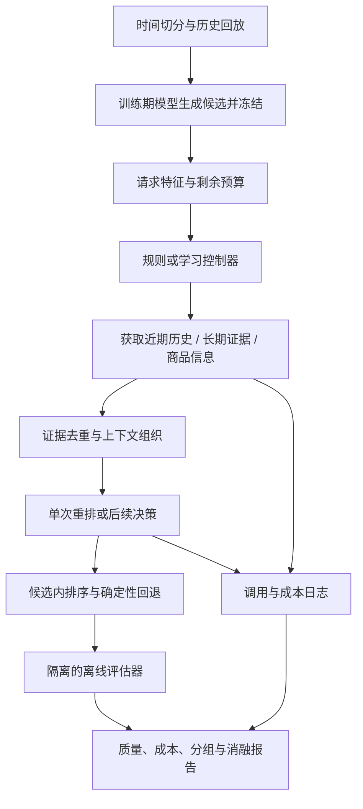

# 自适应证据检索的 Agentic Recommendation：项目设计

**英文工作名：Adaptive Evidence Acquisition for Agentic Recommendation**

**设计日期：2026-09-23 · 状态：实施与开发实验进行中，最终结论尚未冻结**

执行状态更新：请看 [持续进度与恢复记录](PROGRESS.md)。M0 已复现，M1a
已有真实 MovieLens 对照及无收益结果，Amazon 画像、时间回放和序列基线已运行。
真实同步／批量 LLM 调用已完成冒烟验证；256 用户开发实验已完成，
[配对结果与不确定性](../../reports/20260924_m2_development_pilot/README.md) 已归档。
完整验证集已完成：[3,318 用户证据结果](../../reports/20260925_m3_evidence_validation/README.md)。
近期方案的整体收益尚未确立，充分证据方案明显下降；历史分组呈现不同方向。
强序列基线与内容消融继续推进，学习路由尚未拟合。
以下正文保留原设计；LLM 和路由能力只有进度记录中的实际实验支持后才算完成。

实际运行入口与资源控制见 [复现说明](REPRODUCE.md)。原有 PR #1 的提交已经
通过 [PR #2](https://github.com/WItaZhang/agentic-rec/pull/2) 保留并进入默认分支。

> 核心问题：对一个推荐请求，什么时候值得补充用户历史或商品信息？能否根据请求的可观测特征分配计算，在推荐质量与实际成本之间取得更好的取舍？

本目录是可以逐步执行的研究与工程计划。方法、数字示例、配置草案和验收目标均不代表已经实现或取得的结果。文档中的建议参数需要在开发集上确定并冻结；简历中的结果必须来自最终实验。

## 阅读顺序

| 文档 | 回答的问题 |
|---|---|
| [01 · 研究问题与方法](01-problem-and-method.md) | 研究假设是什么，控制器如何决定获取哪些信息，何时停止？ |
| [02 · 数据与评估协议](02-data-and-evaluation.md) | 如何构造真实请求、时间切分、候选集合，避免未来信息泄漏？ |
| [03 · 实现设计](03-implementation.md) | 复用哪些代码，新增哪些模块、接口、配置与日志？ |
| [04 · 实验计划](04-experiments.md) | 与谁比较，如何做消融、成本测量、统计分析与失败分析？ |
| [05 · 分阶段路线图](05-roadmap.md) | 每次实现什么、如何验收、何时继续或调整方向？ |
| [06 · 相关工作与研究边界](06-related-work.md) | 已有什么工作，哪些说法需要谨慎，哪些资料值得先读？ |
| [07 · 简历与成果表述](07-resume.md) | 做到什么程度能写什么，完成后如何用英文 LaTeX 表达？ |

## 1. 项目最终要交付什么

1. 一个基于真实历史交互的可复现推荐评估流程，能够检查每条证据在预测时是否可见。
2. 同一候选池上的常规推荐、单次 LLM 重排、固定流程和自适应策略。
3. 一个轻量学习控制器：第一版选择证据获取方案，第二版按需要扩展为逐步选工具与停止。
4. 覆盖效果、实际 token、工具调用、延迟、失败率的实验报告与质量—成本曲线。
5. 能解释“哪些证据对哪些请求有用”的分组分析、消融和失败案例。
6. 一份可核对的成果记录：配置、数据/候选清单哈希、运行记录、统计脚本与证据对应关系。

成功不预设某个提升百分比。主要目标是在足够强的对照下，判断有针对性的信息获取是否有价值，以及其适用边界。若固定单次重排更好，也应保留该发现，并让最终系统采用实验支持的方案。

## 2. 当前仓库与新计划的关系

以下是检查时的仓库状态，后续实现者应重新核对分支与提交：

| 已有内容 | 检查点 | 可复用部分 | 尚需补齐 |
|---|---|---|---|
| 默认分支的参考框架 | `78716be78dafdac75fdb85e8a23dd79caeb4baed` | 组件注册、Agent、工具、记忆、规划器、mock 测试 | 真实数据适配、严格时间可见性、固定候选约束、真实资源统计 |
| MovieLens 实验基础 | [PR #1](https://github.com/WItaZhang/agentic-rec/pull/1)，分支检查点 `ad358061d001cc2c039d905dfc58c38aa2c14b03` | `uv.lock`、YAML 配置、`src/` 分层、全局时间切分、Popularity 及运行产物 | ItemKNN、Agent 接入、逐事件协议、策略训练与更多实验 |

PR #1 在本设计检查时仍处于打开状态；本次只添加设计文档，不合并或改写该 PR。它已有 MovieLens 基线记录，这不等于本方案的自适应策略已经实现。

MovieLens 现有协议是固定训练历史下的**时间窗口、多正例评估**；本计划的主实验是 Amazon 的**逐事件、单目标预测**。两者各有作用，必须使用不同 `protocol_id`，不能直接比较其 NDCG/Recall 数值。

## 3. 建议固定的第一版范围

- **任务**：用预测时可见的历史，对一个真实的下一物品目标做推荐排序。
- **数据**：先在 MovieLens 验证基础工程，再选择 Amazon Reviews 2023 的一个品类做文本证据主实验。
- **候选**：常规模型生成固定候选；各策略只改变信息获取与排序，不改变候选成员。
- **基础模型**：Popularity 作为校验，ItemKNN 作为起点；再加入 SASRec 或其他充分调参的序列基线。
- **证据**：近期行为、相关长期行为、候选商品属性；有可靠时间戳的商品评论作为后续扩展。
- **模型**：固定一个 LLM 版本做主要对照，轻量控制器优先用线性模型或梯度提升树。
- **学习**：先学习请求级方案选择，再考虑多步决策；不把 LLM 微调或强化学习设为前置条件。
- **输出**：候选内的唯一物品 ID 排序，以及结构化调用记录；解释文字不是主要质量指标。

会话模拟、候选池扩展、多 Agent 协作、在线服务、LLM 微调和跨品类泛化可以后续增加。它们应各自有明确问题与对照，不作为第一轮成果的依赖。

## 4. 系统流程

第一版只做一次方案选择，按预先定义的工作流执行。第二版才允许证据返回后再次决定行动；报告和简历必须区分这两个实现层级。

## 5. 研究假设与对应证据

| 假设 | 如何验证 | 不支持时怎么办 |
|---|---|---|
| H1：额外文本证据能改善部分请求的排序 | 单次重排的证据增删实验；同候选、同模型、同输出约束 | 检查数据、基线和上下文；如果仍无收益，降低 LLM 在方案中的作用 |
| H2：收益随请求特征而变化 | 分组结果、训练期方案结果矩阵、组内置信区间 | 若最佳方案几乎处处相同，采用固定方案 |
| H3：可观测特征能预测有用的证据方案 | 学习策略对比规则、随机分配与训练期上界诊断 | 若预测无效，保留更简单的规则并报告适用边界 |
| H4：信息分配比单纯增加计算更有效 | 质量—成本曲线、成本相近的随机对照、充分证据单次重排 | 若差异来自更多 token，收窄结论为上下文收益 |
| H5：逐步停止能进一步节省资源 | 在完成请求级方案选择后，新增逐步策略与固定长度对照 | 若没有额外收益，停留在请求级路由 |

## 6. 开始实现前的三个决定

1. **确定协议版本**：复现 MovieLens v0，还是实现 Amazon v1？先完成一个可核对的阶段。
2. **确定资源预算**：记录本轮可接受的调用上限、token/金额预算、模型版本与并发。未填写预算不运行付费批量实验。
3. **冻结一份开发配置**：品类、切分、候选数、样本清单和评估指标都写入配置；观察测试结果后改方案必须升级实验版本。

第一步建议执行路线图中的 M0：复现并检查已有真实数据基础。完成后再做 ItemKNN 和小规模 LLM 可行性实验。

## 7. 结果与状态维护规则

- 完成一个里程碑，就在 [路线图](05-roadmap.md) 填入实现提交、运行目录和报告链接。
- `planned / implemented / validated / inconclusive` 分开记录；“代码能运行”不等于“假设已验证”。
- 所有性能结论必须链接运行产物；引用的外部论文结果不能当成本项目结果。
- 文档示例不是可直接运行的配置。本目录的接口和 YAML 在实现前都标为草案。
- 公开版本只提交允许分享的代码、聚合结果与经过检查的案例；原始数据、API 密钥和完整私人运行日志不入库。
