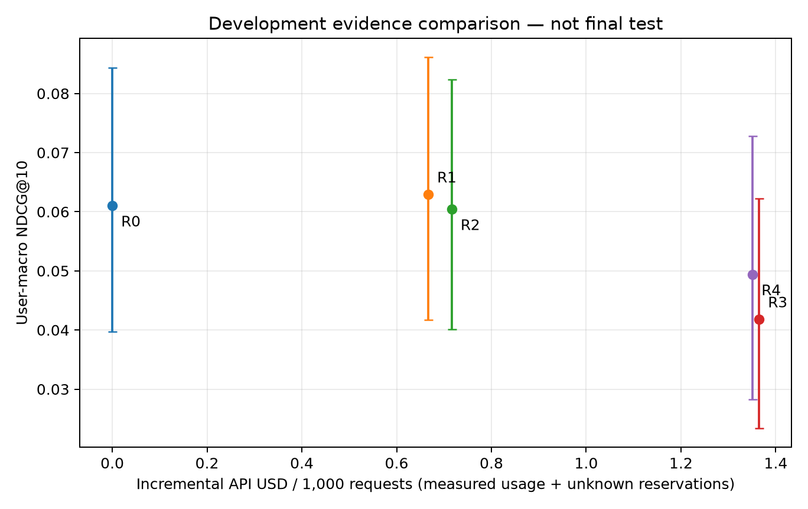

# Real-API development pilot (not final test)

256 uniformly hash-sampled policy-period users, one eligible request per user;
fixed ItemKNN top-200 candidates; positive unseen next-event protocol. R1 uses
the latest event, R2 up to 20 events, R3 latest event plus item categories, and
R4 full history plus categories. All use candidate titles and one call to the
dated GPT-4.1 mini snapshot. R0 retains the base ranking.

| Plan | NDCG@10 | HR@10 | Accounted API USD / 1,000 requests |
|---|---:|---:|---:|
| R0 | 0.060999 | 0.117188 | 0 |
| R1 | 0.062963 | 0.125000 | 0.666713 |
| R2 | 0.060402 | 0.125000 | 0.716239 |
| R3 | 0.041838 | 0.082031 | 1.364823 |
| R4 | 0.049372 | 0.089844 | 1.351078 |

All plans retain candidate misses, 17 cold targets and the one failed API call
in the denominator. Candidate recall is 0.554688. R1 minus R0 NDCG is +0.001965,
95% paired-user bootstrap interval [-0.006972, +0.010661]. R4 minus R0 is
-0.011626 [-0.034671, +0.011856]. These nominal development intervals do not
establish an improvement or quality equivalence. There are 224 zero-history,
21 one-history and 11 older-history users. Warm-group observations are too
sparse for efficacy claims. Category addition is directionally harmful overall;
the zero-history R3 minus R1 interval is [-0.047917, -0.005273], an exploratory
finding requiring independent validation.

489 groups contain independent calls with exactly identical model input and
the same request. 118 change ranking and seven change NDCG. A label-aware choice
between those repeats alone gives mean +0.002493 NDCG within such groups. Thus
the full label-aware oracle (0.094458) includes generation noise and is not
evidence of learnable routing headroom. Subsequent matrices share an output
only for identical inputs at the same request and candidate snapshot.

1024 generation attempts: 1023 complete, one HTTP 429 with unknown usage.
Known usage is 5,614,368 input tokens (4,196,224 cached) and 36,828 output tokens.
Known usage-priced cost is USD 1.0458048; the failed call retains USD 0.0035016,
giving USD 1.0493064 accounted. This is usage-based accounting, not an invoice.
The first 48 attempts preceded a rate-limit amendment; remaining attempts used
concurrency four, 120k input/output tokens per minute and 60 requests/minute.
Do not treat pooled queue-inclusive latency as a controlled serving comparison.
Generation network means are approximately 1.07–1.11 seconds; queue means are
approximately 10 seconds. Per-call breakdowns and process resource manifests
are retained. Batch feasibility has separate pricing and unknown service latency.

The archived config/manifests distinguish initial source `6c244dc`, resumed
source `7c26d47`, and analysis source `d6b41bf`. Full local outputs are under
`logs/20260923_235347_amazon_llm_development_pilot_resume`; analysis is under
`logs/20260924_004054_amazon_pilot_analysis`. Curated copies accompany this report.

## Next development design, fixed before validation outcomes

- Keep model, prompt, evidence limits, candidate generator and cutoffs unchanged.
  Increase only the input rejection cap to 16,384 so rare longer histories can
  be checked before generation; no extra text is introduced by that cap.
- Train routing on all 917 nonempty-history user states plus 128 hash-sampled
  empty-history states. Select one request per user before stratification and
  fit with inverse inclusion weights. This is not a population quality sample.
- Evaluate the full 3,318-user validation population, including 2,968 empty
  histories. Pilot SD implies roughly 2,769 users for 80% power at an absolute
  0.01 NDCG difference for R4 versus R0 under a normal approximation; use the
  available population rather than stopping when an attractive estimate appears.
  Subgroup and HR precision remain limited; this calculation is not a guarantee.
- Freeze simple rules, small regression/boosting router grids, budget points and
  a 0.002 absolute validation selection tolerance before routing selection.
  That tolerance is an engineering selection rule, not proof of equivalence.
- Reserve at most USD 6 for policy labels and USD 12 for validation labels, after
  exact token preflight. Use offline batch pricing and same-request exact-input
  sharing. Whole-campaign planning stop is USD 45 within the authorized USD 50.
  Final test, repeat diagnostics, content controls and strong-base checks use
  the remaining budget only after their own estimates. Final test is unscored.

No multi-step tool-selection or learned-routing result is claimed here.
