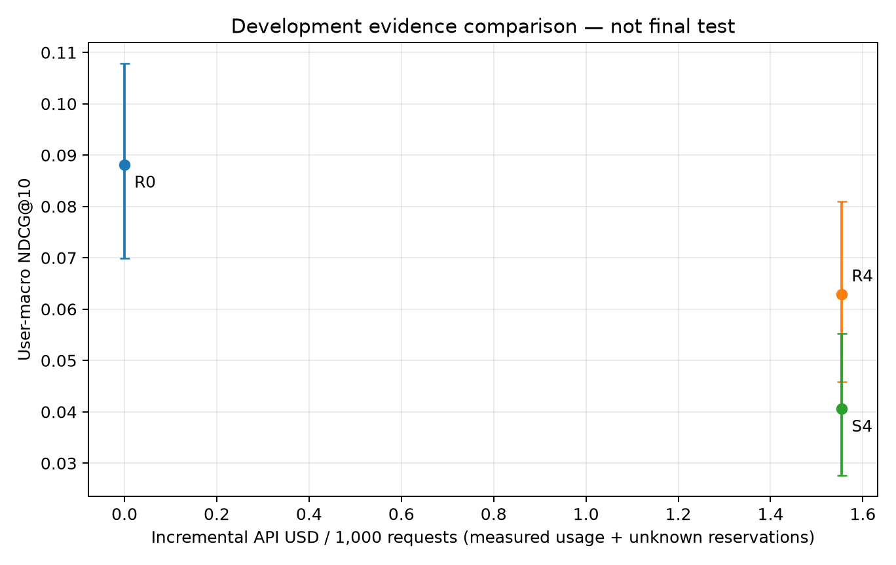

# Equal-token category-alignment control (development only)

Correct category alignment is better than shuffled alignment among requests with history, but full evidence still underperforms ItemKNN on this diagnostic cohort. This does **not** establish that adding categories improves recommendation over title/history inputs, or that more tokens are beneficial.

The diagnostic sample contains all 350 validation users with prior history and 128 sampled users with empty history, one preselected request per user. Its unweighted mean is **not a population estimate**. Candidates and labels follow the same immutable temporal protocol as the [population validation](../20260925_m3_evidence_validation/README.md). All 478 requests, 191 retrieval misses and 46 cold targets remain in denominators.

R4 supplies recent/older history, titles and available categories. S4 permutes only the correspondence between candidate items and category strings (seed 271828); candidate IDs/order, titles, history and the category-text multiset remain fixed. All **478 input-token pairs match exactly in actual provider usage**, including schema overhead. Each arm consumed 3,646,075 input and 17,208 output tokens, USD 0.7429814 at Batch prices. This isolates category alignment relative to a deliberately corrupted control; it does not isolate useful information relative to neutral padding. One shuffle seed and one model snapshot limit generalization.

| Diagnostic cohort | Users | ItemKNN R0 | Full R4 | Shuffled S4 | R4 − S4, paired 95% CI |
|---|---:|---:|---:|---:|---:|
| All, unweighted | 478 | 0.088148 | 0.062868 | 0.040595 | +0.022272 [0.004417, 0.040246] |
| Empty history | 128 | 0.089132 | 0.055143 | 0.089474 | −0.034331 [−0.065676, −0.004465] |
| One event | 247 | 0.083936 | 0.069149 | 0.024430 | +0.044719 [0.017446, 0.072999] |
| At least two | 103 | 0.097025 | 0.057404 | 0.018617 | +0.038787 [0.012526, 0.069867] |

Values are NDCG@10. R4 − R0 = −0.025280 [−0.045475, −0.004927]. Intervals use 10,000 paired user-bootstrap replicates, seed 42, and are nominal exploratory intervals without multiplicity correction. History thresholds were fixed from the training profile. No test data were scored.

The opposite direction for empty histories shows why an overall claim that “correct categories help” would be misleading. With history, correct correspondence matters relative to incorrect correspondence; without history, it can bias the model toward categories that do not match the next reviewed item. The latter explanation is a hypothesis, not an identified mechanism. Static crawler categories can also be coarse or inaccurate. The complete population ablation R3 − R1 is negative, so the combined evidence supports retaining the simpler input option in the candidate set, not expanding full-evidence use.

All 956 calls completed on `gpt-4.1-mini-2025-04-14`; there were no generation retries or missing responses. R4 had 5 deterministic ranking repairs and S4 had 18. Repairs are included in the outcomes and costs; a larger shuffled-arm repair count is part of its observed response to corrupted inputs, so the quality difference is not a claim restricted to perfectly formatted outputs. R4 is a fresh replicate of the same treatment used in population validation, not a reuse of that run's outputs. Temperature zero does not guarantee identical results.



Provenance and reproduction:

- Preparation: `logs/20260924_010156_amazon_content_control_prepare`.
- Execution: `logs/20260925_071014_amazon_content_control_batch`; 25 fully collected shards, runtime source `64fa0c2`. Actual total USD **1.4859628**; Batch turnaround is not serving latency.
- Evaluation: `logs/20260925_072306_amazon_content_control_evaluate`, source `771f8a6`.
- Analysis: `logs/20260925_072335_amazon_content_control_analysis`, source `f8630c8`; [config](config.yaml), [full statistics](analysis.json), [metrics](metrics.json), [manifest](manifest.json).
- Public [derived archive](../../artifacts/published/content_control_v1/archive_manifest.json), containing no review text or credentials. Recompute without API/data access from the inner project root:

```powershell
uv run --locked --extra yaml --extra experiments python main.py --config configs/content_control_archive_reanalysis.yaml
```

Frozen final-test policies have not yet been evaluated. These development results do not establish adaptive-routing gains or justify multistep acquisition.
