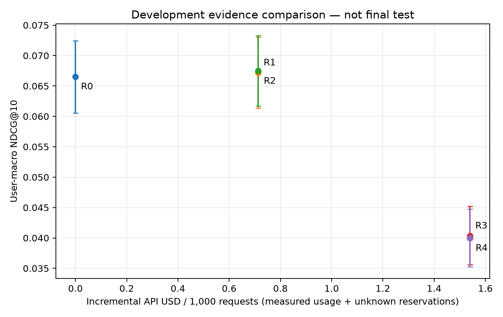

# Complete evidence validation on 3,318 users

This is development validation, not the final test. The complete matrix retains
all 3,318 users, 1,480 unrecalled targets and 418 targets outside the training
catalog. One hash-selected positive unseen request per user; fixed ItemKNN
top-200 candidates. No target is added to retrieval. The full population has
2,968 empty histories, 247 one-event histories and 103 histories of at least two
events. All estimates below come from actual provider responses.

| Method | NDCG@10 | HR@10 | Observed batch API USD / 1,000 requests |
|---|---:|---:|---:|
| R0: ItemKNN | 0.066556 | 0.144665 | 0 |
| R1: latest event, titles | 0.067168 | 0.147981 | 0.713057 |
| R2: up to 20 events, titles | 0.067486 | 0.149186 | 0.713698 |
| R3: latest event, titles/categories | 0.040342 | 0.087402 | 1.539425 |
| R4: up to 20 events, titles/categories | 0.039997 | 0.086799 | 1.540356 |

The costs describe executing one action per request at the observed batch prices.
They are not synchronous serving estimates or savings from label sharing.
Candidate recall@200 is 0.553948 for every action. The R0 metrics exactly match
the separately completed conventional baseline comparison.

## Paired comparisons

Ten thousand paired-user bootstrap draws, seed 42, nominal 95% intervals:

| NDCG difference | Estimate | 95% interval |
|---|---:|---:|
| R1 − R0 | +0.000612 | [−0.002067, +0.003260] |
| R2 − R1 | +0.000318 | [−0.000723, +0.001403] |
| R3 − R1 | −0.026826 | [−0.032706, −0.021163] |
| R4 − R0 | −0.026559 | [−0.032734, −0.020497] |
| R4 − R2 | −0.027489 | [−0.033346, −0.021826] |

Recent-history reranking has no established aggregate gain, and the interval
crossing zero does not demonstrate quality equivalence. Adding categories is
harmful in this development comparison and roughly doubles API cost. Additional
history alone has no established aggregate gain. The token-matched category
alignment control is a separate pending experiment; these comparisons alone
cannot separate category content from context-length effects.



## History-state heterogeneity

| History state | Users | R0 NDCG | R1 NDCG | R2 NDCG | R4 NDCG | R1 − R0 interval |
|---|---:|---:|---:|---:|---:|---:|
| Empty | 2,968 | 0.064052 | 0.066427 | 0.066427 | 0.037208 | [+0.001419, +0.003380] |
| One event | 247 | 0.083936 | 0.086278 | 0.086278 | 0.071106 | [−0.023607, +0.028432] |
| At least two events | 103 | 0.097025 | 0.042668 | 0.052908 | 0.045751 | [−0.105582, −0.006307] |

These groups were specified from the training history distribution; their
comparisons are exploratory. Empty-history R1 has no personal history at all,
so its small gain is a title/base-prior reranking effect, not evidence that user
history helps. Conversely, the older-history group loses quality under R1;
adding more available history does not establish recovery (R2 − R1 interval
[−0.024240, +0.045828]). This contradicts the initial intuition that requests
with history should be the main recipients of extra calls.

The router study is therefore continued to test whether observable state can
predict **when to avoid an LLM**, not to presume a gain from more context.
`amazon_routing_grid_v2.yaml` adds `recent_if_no_history` and
`recent_unless_older` to the simple rules before router fitting or final testing.
The original v1 grid is preserved. Learner families, penalty grid, budgets,
primary learned-vs-rule comparison and tolerance remain unchanged. This is a
documented validation-informed baseline strengthening, not a preregistered rule
discovery or a test-selected change. No sequential acquisition result is claimed.

## Execution checks and actual costs

There were 6,842 physical generation calls for 13,272 logical action outcomes.
6,430 exact-input outcomes share a draw only within the same request and
candidate snapshot. Zero/one-history R1 and R2 are therefore identical where
their inputs match; stochastic repeats cannot create artificial evidence gain.
All 6,842 calls completed with known usage: 37,580,364 input tokens, 246,312
output tokens, zero cached tokens and USD **7.7131224**. There were no generation
retries or missing batch responses. A delayed shard eventually completed all
149 requests; no straggler was excluded. Batch turnaround is not serving latency.

Ranking repair affected 15, 13, 6 and 5 logical requests for R1–R4 respectively.
Repairs fill from the same frozen base order and incur no additional LLM call.
The five R4 repaired requests could change its population NDCG by at most
5/3318 = 0.001507; they cannot alone explain its 0.026559 deficit. Candidate
membership, target isolation, metric denominators and saved configuration hashes
are checked. The negative result is retained without retuning on the test set.

The label-aware oracle NDCG is 0.095011, but it is not a deployable method and
does not prove that its headroom is predictable. Different-input generation
noise remains; the development pilot documents temperature-zero output variation.

## Reproduction and provenance

- Preparation: `logs/20260924_004459_amazon_validation_matrix_prepare`.
- Generation: `logs/20260924_005558_amazon_validation_batch_resume`, parent runtime
  commit `453746d`; included runtime provenance distinguishes imported parent
  code from later filesystem commits. The first pre-submit floating-sum issue
  was fixed before the affected shard was reserved or uploaded.
- Complete matrix: `logs/20260925_071030_amazon_validation_matrix_evaluate`,
  clean source `72deac0`.
- Analysis: `logs/20260925_071120_amazon_validation_evidence_analysis`, clean
  source `d8b22f6`.
- Derived public data: `artifacts/published/validation_v1`, with user ordinals,
  per-request outcomes, physical call IDs and usage; no review text or secrets.

```sh
uv run --locked --extra yaml --extra experiments python main.py --config configs/validation_archive_reanalysis.yaml
```

`logs/20260925_071447_validation_archive_reanalysis` reproduced every numeric
analysis value with maximum absolute difference 0.0. The command needs no raw
dataset, credential, model weight or API access. The configured 1e-14 tolerance
only accommodates floating reduction roundoff. Original API execution is a
separate paid reproduction requiring its own authorized key and budget.
