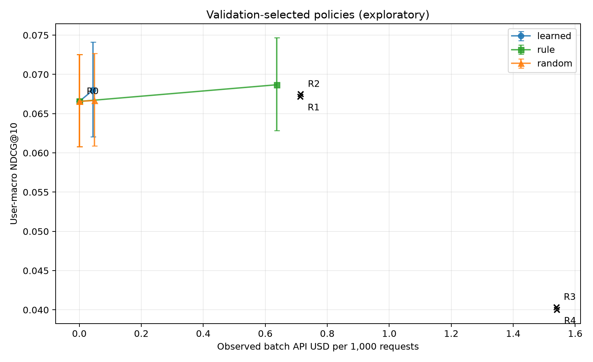
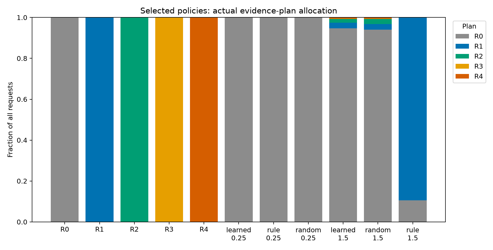

# Real-data routing validation (development only)

The complete expanded controller was fitted and its choices evaluated on 3,318 independent validation users. At the registered primary budget of USD 0.25 per 1,000 requests, the learned, rule, fixed and random controls all retain the ItemKNN ranking on this validation set. This is an observed collapse to the baseline, not evidence that learned routing improves quality or that a zero-width bootstrap interval proves population equivalence. Test-time learned decisions can still differ for new feature values.

At the registered secondary budget 1.5, the selected learner invokes the LLM for 174/3,318 requests (5.24%). The selected rule invokes recent-evidence reranking for all 2,968 empty-history requests (89.45%). Learning spends less, but quality preservation versus that rule is not established: NDCG difference -0.000675, nominal paired 95% interval [-0.002495, +0.001203], one-sided 95% lower bound -0.002205 below the frozen -0.002 tolerance. HR difference is -0.006631 [-0.010850, -0.002411]. These are post-selection development intervals; no confirmatory saving-with-preserved-quality claim is made.

## Measured validation outcomes

| Method / validation budget | NDCG@10 | HR@10 | API USD / 1,000 | LLM request fraction |
|---|---:|---:|---:|---:|
| fixed_R0 | 0.066556 | 0.144665 | 0.000000 | 0.0000% |
| fixed_R1 | 0.067168 | 0.147981 | 0.713057 | 100.0000% |
| fixed_R2 | 0.067486 | 0.149186 | 0.713698 | 100.0000% |
| fixed_R3 | 0.040342 | 0.087402 | 1.539425 | 100.0000% |
| fixed_R4 | 0.039997 | 0.086799 | 1.540356 | 100.0000% |
| learned_0.25 | 0.066556 | 0.144665 | 0.000000 | 0.0000% |
| rule_0.25 | 0.066556 | 0.144665 | 0.000000 | 0.0000% |
| random_0.25 | 0.066556 | 0.144665 | 0.000000 | 0.0000% |
| learned_1.5 | 0.068006 | 0.145268 | 0.044181 | 5.2441% |
| rule_1.5 | 0.068681 | 0.151899 | 0.636895 | 89.4515% |
| random_1.5 | 0.066676 | 0.144967 | 0.048377 | 5.9072% |

All methods above use the same 200 fixed candidates per request and candidate recall 0.553948. Cold targets, retrieval misses, repairs and failed requests remain in the denominator. Costs are counterfactual single-action Batch API charges from observed usage, excluding separately reported controller CPU. They are not synchronous serving prices or measured online latency. All logical calls have known usage; no API generation failure occurred in the expanded matrices.

Budget numbers are selection envelopes, not actual spending. The selection rule first finds the best feasible quality and then chooses the cheapest candidate within 0.002. Consequently, a policy selected under the 1.5 envelope can itself spend less than 0.1, while the 0.1 envelope selects all-base because its feasible best is different. This behavior follows the unchanged v2 rule; no budget or tolerance was moved after these results.





## Random allocation and what can be claimed

At envelope 1.5 the frozen-seed random control spends USD 0.048377/1,000, versus learned USD 0.044181. Learned minus random NDCG is +0.001330, nominal interval [-0.000413, +0.003103]; it does not establish superiority. The random allocator's exact expectation over the same real outcome matrix matches learned cost at USD 0.044181/1,000. Against that expectation the descriptive difference is +0.001611 [0.000100, 0.003189]. Five previously listed sensitivity seeds give random NDCG 0.066048–0.066946. Neither the expectation nor those draws add independent users or justify promoting this secondary point to the primary comparison.

## Fit, data and reproduction

- Policy labels: 1,045 users (all 917 users with observed history plus 128 sampled empty-history users), 4,180 logical action rows from 2,612 physical generations. Identical inputs share a draw only within the same request.
- Actual label construction: 14,517,964 input tokens, 94,032 output tokens, zero cached input tokens, USD 2.9788184. Earlier partial calls are included once, not added again. Upload recovery repeated no generation and created no additional reservations.
- Four estimators: Ridge alpha 1/10 and two histogram-boosting variants, 32 estimator/penalty combinations, seven rules, five fixed plans. Fitting uses normalized inverse-inclusion weights. Features contain no request IDs, user IDs, current target or current review.
- Source evaluation: `logs/20260930_204324_amazon_policy_matrix_evaluate` (`5aa4978`). Fit: `logs/20260930_204405_amazon_routing_development_v2` (`4ee41e1`). Analysis: `logs/20260930_204625_amazon_routing_validation_analysis` (`adc13e6`). Exact original configs and hashes accompany the artifacts.
- The offline refit at `logs/20260930_204717_amazon_routing_archive_refit` (`c02adbd`) reproduces all four model file hashes, all selection values excluding runtime measurements, and all 25 policies' actions for 3,318 validation users. No dataset, credential or API access was used. See [verification](refit_verification.json).
- Public derived training matrices: [routing_training_v2](../../artifacts/published/routing_training_v2); selected models: [frozen_router/v2](../../artifacts/frozen_router/v2); policy outcome archive: [routing_validation_v2](../../artifacts/published/routing_validation_v2).

From the inner project root:

```sh
uv run --locked --extra yaml --extra experiments python main.py --config configs/amazon_routing_archive_refit.yaml
uv run --locked --extra yaml --extra experiments python main.py --config configs/routing_validation_archive_reanalysis.yaml
```

The first command refits from public derived matrices; the second verifies archived outcome statistics. Training-cohort diagnostics are [separate](policy_train_diagnostics.json): their enriched unweighted mean is not population performance, and a label-aware oracle is never a deployable method.

## Practical method selection and remaining work

The previously registered all-method adoption rule selected the **causal sequence recommender**, with validation NDCG 0.068723 and zero API calls, from the same 3,318 users. Its improvement over ItemKNN is a conventional-model comparison on its own candidates, not a routing gain. See [decision](deployment_selection.json). The selected method will be evaluated without reselection on final test.

Strong-sequence evidence robustness and candidate-row presentation sensitivity are running. The final test is unscored, controlled serving latency is unmeasured, and no multistep acquisition or stopping result is claimed. Final delivery still requires these controls, the frozen test, resource/failure analysis, and revised career materials.
