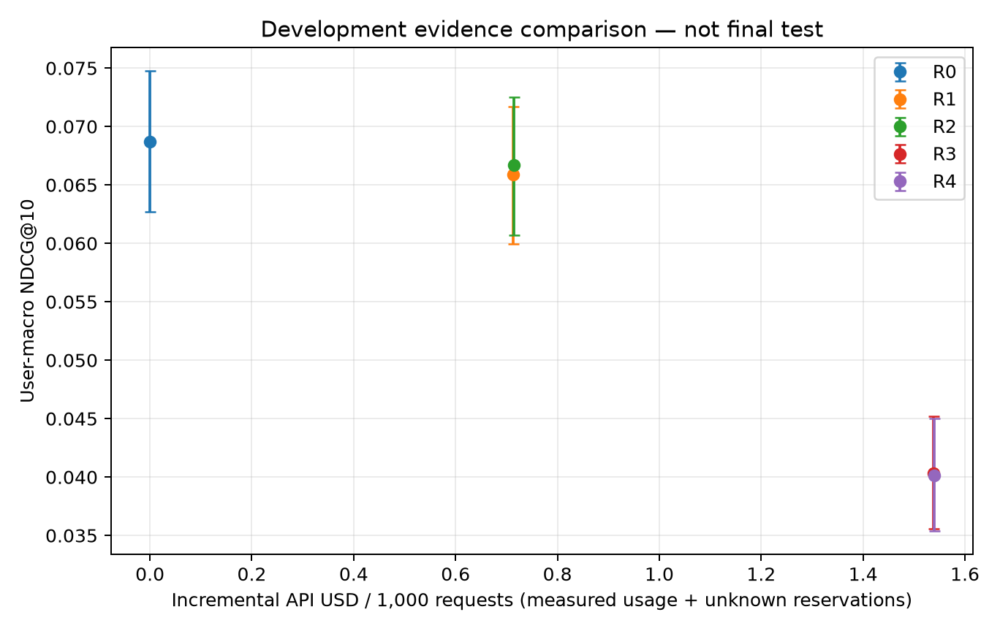
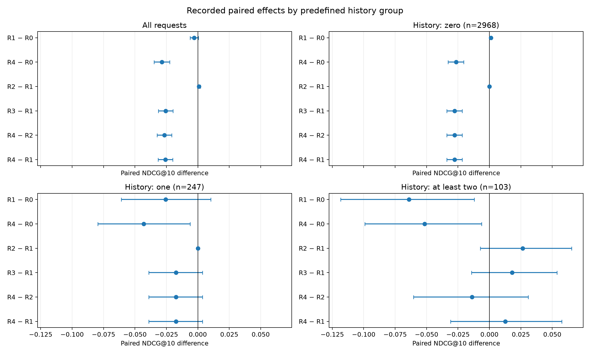

# Evidence under the stronger causal sequence recommender

Strengthening the base recommender does not reverse the observed full-evidence loss. On all 3,318 validation users, recent-history reranking has an unresolved aggregate effect and full evidence substantially lowers NDCG. These are **development diagnostics**, not final-test findings or a new method-selection round.

The frozen SASRec-style, full-softmax sequence adaptation was selected entirely within the base-training period. This comparison uses the same requests, prediction-time histories, model snapshot, prompt, R0–R4 evidence definitions and 200-candidate protocol as the [ItemKNN experiment](../20260925_m3_evidence_validation/README.md). Each request keeps the sequence model's own candidates fixed across actions. No target is added; 1,493 retrieval misses, including 418 cold targets, remain in every metric denominator. CandidateRecall@200 is 0.550030 for every action. The base NDCG agrees with the earlier independently computed conventional comparison to floating-point roundoff.

## Complete within-retriever results

| Action | NDCG@10 | HR@10 | API USD / 1,000 | Logical requests repaired |
|---|---:|---:|---:|---:|
| R0 | 0.068723 | 0.146474 | 0.000000 | 0 |
| R1 | 0.065868 | 0.143159 | 0.713509 | 17 |
| R2 | 0.066690 | 0.144063 | 0.714150 | 13 |
| R3 | 0.040331 | 0.088005 | 1.538338 | 7 |
| R4 | 0.040161 | 0.087101 | 1.539269 | 4 |

R1 is titles plus the latest available user event; R2 supplies up to 20 available events in total. R3/R4 add categories to R1/R2 respectively. R4 is one fixed local evidence workflow followed by one LLM call. Costs represent executing each action once at the observed Batch tariff; shared offline labels are not counted twice in the construction total. Marginal intervals in the figure are not the paired intervals used for contrasts below.

| Within-sequence contrast | NDCG difference, paired 95% CI |
|---|---|
| R1 - R0 | -0.002855 [-0.006230, +0.000434] |
| R4 - R0 | -0.028562 [-0.034887, -0.022317] |
| R2 - R1 | +0.000822 [-0.000217, +0.002039] |
| R3 - R1 | -0.025537 [-0.031385, -0.019841] |
| R4 - R2 | -0.026529 [-0.032421, -0.020770] |

Intervals use 10,000 paired user-bootstrap replicates, seed 42, with nominal 95% coverage. All ablations and groups are exploratory, without multiplicity correction. The R1 interval crosses zero and extends to a meaningful loss: it establishes neither a benefit nor quality preservation. Adding categories is harmful at the population level under both history lengths. Additional history alone has a small unresolved overall difference.



## Predefined history groups

| Prior events | Users | R1 - R0, paired 95% CI | R4 - R0, paired 95% CI |
|---|---:|---|---|
| zero | 2968 | +0.001161 [+0.000333, +0.002055] | -0.026568 [-0.032918, -0.020504] |
| one | 247 | -0.025598 [-0.060895, +0.010287] | -0.042963 [-0.079536, -0.006192] |
| at_least_two | 103 | -0.064019 [-0.118284, -0.012068] | -0.051482 [-0.098976, -0.006284] |

The small positive R1 difference for empty histories cannot be attributed to reading personal history: no historical event exists for those requests. It reflects title/base-prior reranking. R1 is harmful in the group with at least two events, while that group's estimate is much less precise. The sparse dataset supports no general conclusion about long user histories. Thresholds zero/one/at-least-two were fixed from the base-training profile.



## Paired sensitivity across recommenders

For each user and action, compute `(action - base under sequence) - (action - base under ItemKNN)`. This keeps each within-retriever comparison paired, then tests whether its observed effect changes. The complete public archives cover the same 3,318 users and retain identical history/cold-item visibility.

| Action relative to its own base | Sequence effect minus ItemKNN effect, NDCG 95% CI |
|---|---|
| R1 - R0 | -0.003467 [-0.006739, -0.000119] |
| R2 - R0 | -0.002963 [-0.005992, +0.000041] |
| R3 - R0 | -0.002178 [-0.005073, +0.000663] |
| R4 - R0 | -0.002003 [-0.004916, +0.000872] |

The R1 effect is lower under the sequence recommender in this nominal exploratory comparison. This includes changes in candidate composition and base order, as well as different output realizations; it does not isolate better embeddings or establish a causal routing gain. R4's large loss persists in both systems; an interaction interval crossing zero does not establish equivalent effects.

Sequence minus ItemKNN base NDCG is +0.002167, with this archive's paired interval [+0.000185, +0.004288]. Candidate recall is slightly lower (difference -0.003918), so “stronger” refers to observed validation ranking quality, not universal retrieval improvement. The earlier conventional report used a different deterministic row order for bootstrap draws; identical means and slightly different Monte Carlo quantiles are expected. Both use the same users. Snapshot hashes include model identity, scores and order; their mismatch is not evidence that every candidate membership set differs.

The model snapshot is pinned, but temperature zero does not eliminate output variation. Runs were executed at different dates; provider-side variation and static crawler metadata assumptions remain limitations. This diagnostic does not change the already frozen practical choice (`causal_sequence`), the router grid, primary budget, tolerance or final-test inputs. No multistep acquisition benefit is inferred.

## Actual execution and reproduction

- Target-free preparation: `logs/20260924_005821_amazon_sequence_validation_prepare`.
- Complete generation: `logs/20260930_205938_amazon_sequence_validation_batch_resume_queue`, runtime `effad47`, preserving the original schedule and proven queue-rejection recovery. All **127 shards / 6,842 physical generations** were collected; one slow tail was retained until completion.
- Observed usage: **37,564,803 input / 246,312 output / zero cached-input tokens**, **USD 7.7100102**. There are 13,272 logical action labels and 6,430 same-request exact-input reuses. No missing usage or failed generation remains in this matrix. Proven pre-generation rejection and upload operations are preserved separately in campaign accounting. Batch turnaround is not service latency.
- Evaluation: `logs/20260930_224532_amazon_sequence_validation_evaluate` (`ad8cf2c`); [metrics](metrics.json), [physical resources](resources.json).
- Analysis: `logs/20260930_224650_amazon_sequence_evidence_analysis` (`16fae5f`); [complete statistics](analysis.json), [config](config.yaml), [manifest](manifest.json).
- Public [derived archive](../../artifacts/published/sequence_validation_v1/archive_manifest.json) contains no review text, prompts, credentials or provider response IDs. Reanalysis `logs/20260930_225143_sequence_validation_archive_reanalysis` (`6006ea0`) reproduces every statistical value exactly; [verification](archive_reanalysis_manifest.json). The later figure rendering uses an explicit legend to disambiguate nearby R1/R2 points; statistical values are unchanged.
- Cross-retriever analysis: `logs/20260930_225257_amazon_retriever_robustness` (`de463f8`); [config](retriever_robustness_config.yaml), [statistics](retriever_robustness_analysis.json), [manifest](retriever_robustness_manifest.json). It reads only the two checksummed public archives and makes no API call.

From the inner project root:

```sh
uv run --locked --extra yaml --extra experiments python main.py --config configs/sequence_validation_archive_reanalysis.yaml
uv run --locked --extra yaml --extra experiments python main.py --config configs/amazon_retriever_robustness.yaml
```

The separate candidate-row presentation diagnostic is still running. Final generations, final quality conclusions and controlled serving latency are pending.

Python 3.12 verification initially found only ~1e-13 USD drift from changed built-in float summation, with all quality fields identical. Explicit original-order reductions preserve the published numbers and the unchanged 1e-14 tolerance. The [Python 3.12 replay](archive_reanalysis_python312_manifest.json), `logs/20260930_230423_sequence_validation_archive_reanalysis`, now reproduces every field exactly.
