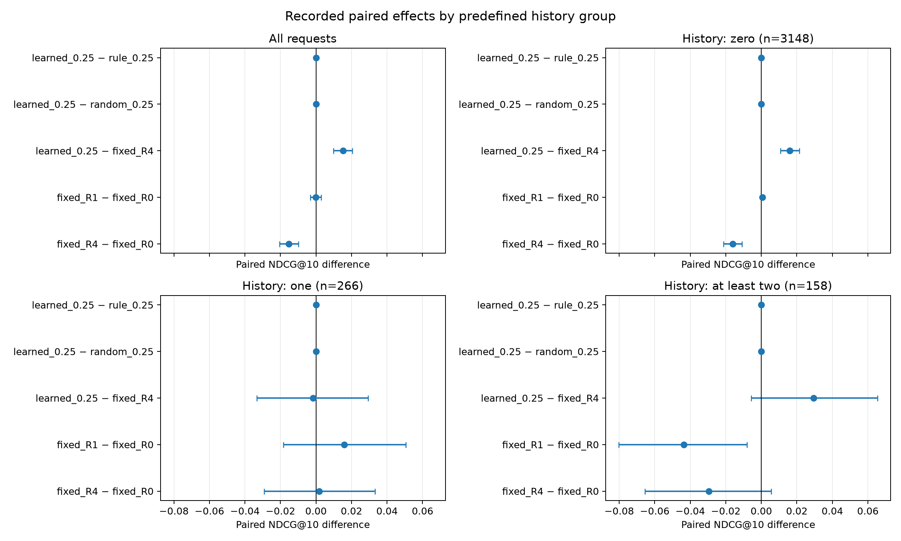
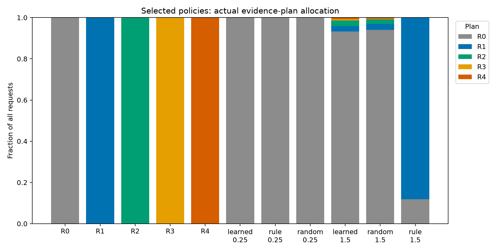

# Frozen final test: selective evidence has a secondary signal, not a primary-policy win

The validation-selected practical method remains the **causal sequence recommender**. No model, prompt, route, budget point, group boundary or deployment choice was changed after final scoring. The primary-budget learned, rule and random policies all choose R0 on every test request; their identical predictions establish no adaptive-policy advantage. A previously frozen higher-budget learner has an exploratory NDCG signal. Its actual cost differs from the frozen random control, so the original and post-evaluation cost-alignment results are reported separately.

## Protocol and complete population

- Amazon Reviews 2023 Magazine Subscriptions, `amazon_next_positive_unseen_v1`; next unseen rating ≥4, one hash-selected request per user before observing labels.
- Global time windows: base training before 2018; policy training 2018–2020; validation 2020–2021; final test 2021–2023-09-10 exclusive. Predict before updates at tied timestamps. Frozen model weights/catalog; strictly past histories.
- All **3,572 users** retained: 3,148 zero-history, 266 one-history and 158 at least two-history users. KNN misses **1,949 targets (54.56%)**, including **685 cold items**. No target insertion, sampled negatives or dropped misses.
- Evidence and routing share the identical KNN top-200 candidate pool per request. Popularity and causal sequence use their own frozen top-200 pools and are marked separately. Evaluate top 10; all-user macro NDCG and HR.
- `gpt-4.1-mini-2025-04-14`, temperature 0, maximum 256 output tokens, strict JSON, no generation retry. Identical same-request inputs may share a physical generation, never across requests or visibility boundaries.
- User-paired bootstrap: 10,000 repetitions, seed 42, nominal 95% intervals. Primary budget USD 0.25/1,000, NDCG margin 0.002 and history groups frozen on validation. Secondary budget-grid intervals are exploratory, not multiplicity-adjusted confirmatory tests.

## Results

API prices below use observed Batch usage, counterfactually charging the chosen action once per request. They exclude CPU, controller training and offline label acquisition. They are **not online service prices or latency**. The observed physical final experiment cost USD **8.416256**; it acquired all actions, not merely one deployed policy.

| Method | NDCG@10 | HR@10 | Batch USD/1,000 requests | LLM calls / 3,572 |
|---|---:|---:|---:|---:|
| Popularity, own pool | 0.042543 | 0.100784 | 0 | 0 |
| Causal sequence, own pool; validation-selected | 0.047393 | 0.105823 | 0 | 0 |
| R0 ItemKNN | 0.045767 | 0.103024 | 0 | 0 |
| R1 recent history + titles, one call | 0.045513 | 0.100784 | 0.713239 | 3,572 |
| R2 up to 20 history items + titles, one call | 0.045849 | 0.101624 | 0.714397 | 3,572 |
| R3 recent history + titles/categories, one call | 0.029380 | 0.069429 | 1.539596 | 3,572 |
| R4 full configured evidence / fixed workflow, one call | 0.030512 | 0.071109 | 1.541184 | 3,572 |
| Primary learned/rule/random/fixed, each all R0 | 0.045767 | 0.103024 | 0 | 0 |
| Secondary learned, nominal budget 1.5 | 0.048531 | 0.104143 | 0.061353 | 243 |
| Secondary random, nominal budget 1.5 | 0.045879 | 0.103024 | 0.050385 | 215 |
| Secondary rule, nominal budget 1.5 | 0.046261 | 0.104703 | 0.627485 | 3,148 |

“1.5” is the validation search budget label, not a claim that actual spend equals USD 1.5. All routes selected at budgets 0, 0.1, 0.25 and 0.5 choose R0; the fixed policy at 1.5 also chooses R0. The learned 1.5 allocation is 3,329 R0 / 96 R1 / 96 R2 / 23 R3 / 28 R4. See [full statistics](analysis.json) and [conventional comparisons](additional_baseline_analysis.json).


Error bars are marginal bootstrap intervals, not paired significance tests. Connected budget points are the frozen grid, not an optimized test frontier. Fixed-action crosses have their paired uncertainty reported below.

| Paired NDCG difference | Difference | Nominal 95% interval | Interpretation |
|---|---:|---|---|
| Primary learned − rule | 0 | [0, 0] | Identical actions; degenerate, no noninferiority claim |
| Primary learned − random | 0 | [0, 0] | Identical actions; no learning advantage |
| R1 − R0 | −0.000254 | [−0.003215, +0.002915] | Unresolved; noninferiority at 0.002 is not established |
| R4 − R0 | −0.015255 | [−0.020532, −0.009929] | Full configured evidence harms this pipeline |
| Learned 1.5 − rule 1.5 | +0.002270 | [+0.000166, +0.004563] | Exploratory; about 90.22% lower Batch spend |
| Learned 1.5 − random 1.5 | +0.002651 | [+0.000508, +0.004993] | Exploratory, but **21.77% more actual spend** |
| Causal sequence − KNN, own pools | +0.001626 | [−0.000143, +0.003411] | Test advantage unresolved; preserve validation choice |

Learned 1.5 versus rule 1.5 HR difference is −0.000560 [−0.003919, +0.003080], and versus random is +0.001120 [−0.002240, +0.004759]. The NDCG signal is not a proven improvement across metrics, domains or model-output realizations. No learner-versus-sequence comparison was registered as the main test. The higher learner point estimate does not authorize selecting it using this test.

## Explicit post-evaluation cost-alignment sensitivity

After observing the final cost mismatch, `configs/amazon_final_cost_alignment.yaml` reuses the development random-calibration formula on **observed costs and saved learner actions only**. It preserves the conditional R1–R4 mixture and scales total call probability. No quality, targets or features enter calibration; a hashed allocation receipt is written before this stage decodes outcome quality. This timing is not a claim that the researcher was blinded: the original final results had already been inspected.

The random expected spend and learned observed spend both equal **USD 0.0613531354983/1,000**. Probabilities R0–R4 are [0.9308551, 0.0273165, 0.0273165, 0.0065446, 0.0079673]. Exact random expectation has NDCG **0.045533664**, versus learned **0.048530842**: difference **+0.002997179**, conditional nominal interval **[+0.001036315, +0.005105311]**. HR difference **+0.001693376 [−0.001321252, +0.004720566]** remains unresolved.

Intervals condition on the saved cost calibration and model outputs; they do not include uncertainty from calibrating a future population or repeated LLM draws. Seed 1729 and the five original sensitivity seeds are all retained: realized random costs range USD 0.058222–0.070402/1,000. Only the full-population expectation is exactly matched. This is an **exploratory robustness signal**, costs no new API calls, changes no frozen comparison and cannot reselect deployment. [Receipt](cost_calibration.json), [complete sensitivity](cost_alignment_analysis.json), source `70b0194`, run `logs/20261001_024305_amazon_final_cost_alignment`.

## Groups, failures and examples



| History group | Users | R1 − R0 NDCG [95% interval] | R4 − R0 NDCG [95% interval] |
|---|---:|---|---|
| Zero | 3,148 | +0.000560 [+0.000188, +0.001019] | −0.015976 [−0.021343, −0.010898] |
| One | 266 | +0.015924 [−0.018352, +0.050635] | +0.001727 [−0.029260, +0.033301] |
| At least two | 158 | −0.043716 [−0.080291, −0.008058] | −0.029489 [−0.065501, +0.005703] |

Zero-history R1 gains cannot be credited to personal history. The one-history intervals are wide; crossing zero does not establish equivalence. These groups were fixed before final scoring; subgroup results are descriptive and the warm groups are small.

All generation outcomes completed, but invalid/short rankings still required deterministic repair: R1/R2/R3/R4 **10/13/13/7 logical requests**. Shared generations mean these counts must not be summed as unique physical repairs. The learner 1.5 has 11 repaired requests among 243 calls; random 1.5 has one among 215. No failure or repair was removed from quality denominators.

| Policy | KNN hits lost | KNN misses rescued | Rank-quality losses | API USD spent on unrecalled targets |
|---|---:|---:|---:|---:|
| R1 | 43 | 35 | 49 | 1.389994 |
| R4 | 305 | 191 | 315 | 3.003855 |
| Learned 1.5 | 15 | 19 | 18 | 0.121515 |
| Random 1.5 | 3 | 3 | 3 | 0.093667 |
| Rule 1.5 | 0 | 6 | 0 | 1.233184 |

Spend on misses is a post-evaluation diagnosis, not an available routing feature. The system cannot know the next target at decision time. Retrieval coverage, cold items and sparse histories remain major constraints; more reranking cannot recover absent targets.

The [registered failure audit](failure_cases.json) selects cases by a fixed hash, not by storytelling convenience. Examples below are the first saved case in the respective registered class:

- R4 lost hit `q_e000001970`: three past magazines (Do it Yourself, Real Simple, Country Living); Good Housekeeping was candidate rank 3 but disappeared from the output top 10, whose first three were House Beautiful, This Old House and Elle Decor. This is observable topical substitution, not proof of a hidden model reason.
- Learned R1 lost hit `q_e000042211`: Do it Yourself and National Geographic Kids in history; Family Handyman was rank 5 but fell out of the top 10. The output began National Geographic Kids, National Geographic Magazine and Smithsonian. Recent-interest domination is a hypothesis consistent with the output, not a causal finding.
- R1 rescue `q_e000032826`: no history; Food Network Magazine moved from candidate rank 11 to output rank 10. This illustrates why a small aggregate gain need not be personalization.



## Provenance, resources and reproduction

All 139 shards completed; 7,460 physical generations supplied 14,288 logical action outcomes, with 6,828 exact same-request input reuses. Actual final usage: **41,007,040 input / 268,560 output / zero cached tokens**, USD **8.416256**, no unknown usage. There were 19 cumulative automatic upload-only recoveries, no generation retries. A Windows atomic state replacement interruption was recovered by matching both preserved file hashes and allowing only one additional poll; no already accepted generation was repeated. See the [progress record](../../docs/adaptive-evidence/PROGRESS.md).

| Artifact | Run / source |
|---|---|
| Immutable pre-test protocol | `artifacts/frozen_protocol/v1/freeze.json`, SHA e18d278b55775c4b2610cdacf6880be6088aa428485da47821fe4220cb3c39b5 |
| Final input preparation | `logs/20260930_211006_amazon_final_test_prepare`, `90f61f3` |
| Completed generation resume | `logs/20261001_020546_amazon_final_test_batch_resume_io`, `77ad488` |
| Complete matrix | `logs/20261001_023000_amazon_final_test_evaluate`, `10ae815` |
| Frozen paired analysis | `logs/20261001_023040_amazon_final_policy_analysis`, `ca00f13` |
| Registered failure analysis | `logs/20261001_023146_amazon_final_failure_analysis`, `ca00f13` |
| Public archive | `artifacts/published/final_test_v1`, publication `logs/20261001_023310_publish_final_test_results`, `ee98ddf` |
| Latest exact numeric replay / plotted figures | `logs/20261001_023704_final_test_archive_reanalysis`, `0be00ee` |

From the inner `agentic-rec/` directory, with no dataset download, model service or API key:

```powershell
uv run --locked --extra yaml --extra experiments python main.py --config configs/final_test_archive_reanalysis.yaml
uv run --locked --extra yaml --extra experiments python main.py --config configs/amazon_final_cost_alignment.yaml
```

The public archive replay reproduced all floating values with **maximum difference zero**, all other fields exactly, under unchanged tolerance 1e-14. Rerendered figures were visually checked. The post-evaluation sensitivity reads that same pinned archive and produces a new timestamped zero-call run.

This report establishes offline final-test quality and counterfactual Batch costs. Real synchronous serving measurements and final campaign accounting are separate deliverables linked from the [consolidated study](../adaptive_evidence_study/STUDY.md). Static crawler metadata may postdate events; pretraining overlap cannot be excluded. One sparse domain, one provider/model snapshot and one generation realization do not establish production CTR improvement or general multistep-agent superiority.
