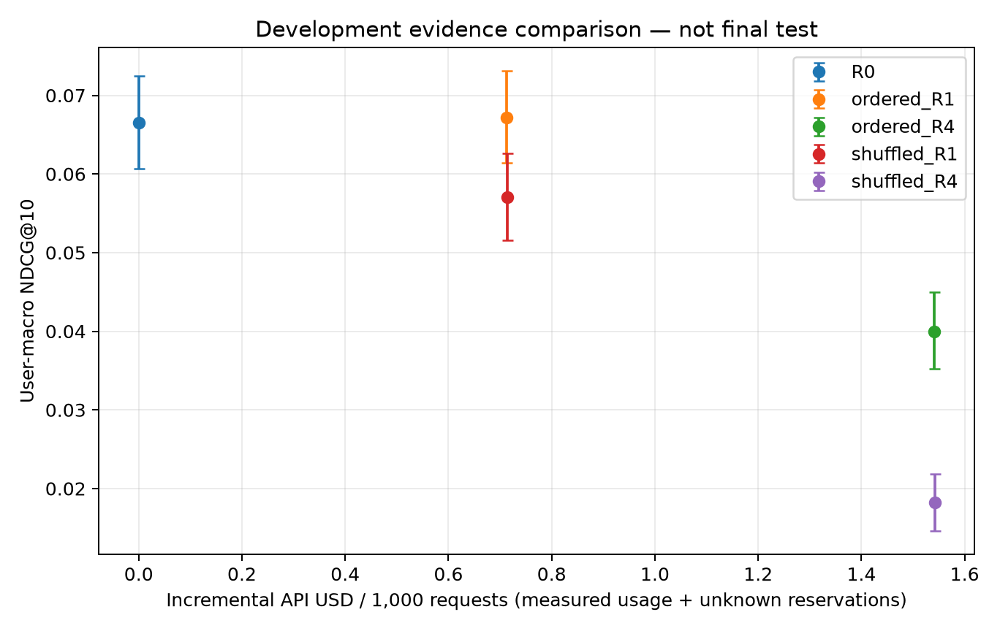
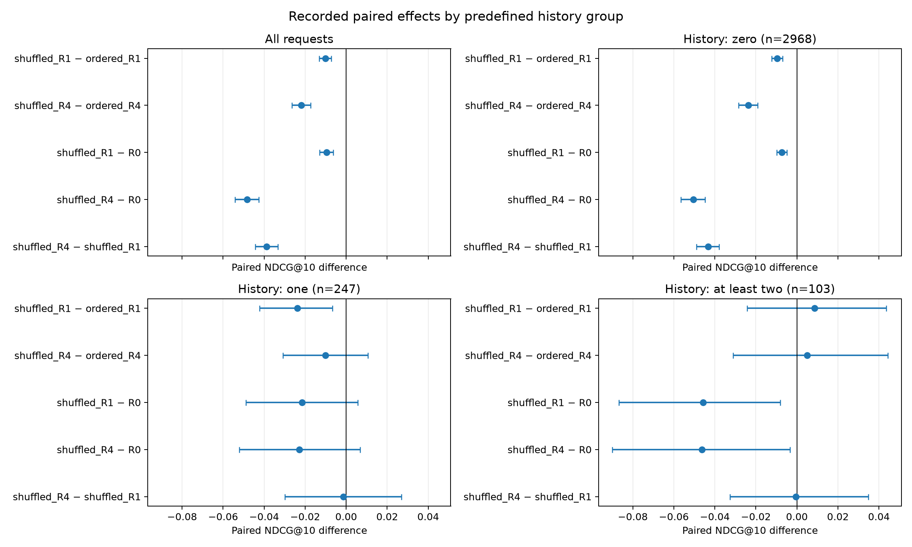

# Candidate-row presentation sensitivity

Completed on 2026-10-01 UTC. This is an exploratory validation diagnostic, **not the final test**. On the same 3,318 users and frozen ItemKNN candidate pools, shuffled presentation lowers recent-evidence NDCG by 0.010127 and full-evidence NDCG by 0.021811 relative to the original presentation. Both nominal paired intervals are below zero. The result shows sensitivity to presentation conditions; it does not isolate pure position bias or establish how the model reasons.

## Protocol and verification

- Same `amazon_next_positive_unseen_v1` validation interval, target-independent one-request-per-user sample, 200 candidates and top-10 evaluation. All 1,480 retrieval misses, including 418 cold targets, remain in every denominator. Candidate Recall@200 is 0.553948 for every method. No target is inserted.
- Same pinned `gpt-4.1-mini-2025-04-14`, temperature zero, strict output schema, 256-output-token limit and zero generation retries. R1 uses at most one recent event; R4 uses at most 20 events plus categories. The identical system instruction and model options are retained.
- A shared request-specific permutation uses seed 8675309 without labels. Candidate alias IDs still encode the original base rank. The order annotation changes truthfully to describe shuffled rows. This is **not removal of the base-rank prior**, an exact-token control, or a post-tool policy.
- [Input equivalence proof](input_equivalence.json) verifies all 6,636 logical R1/R4 pairs against actual submitted JSONL, including canonical shared calls. After JSON normalization, candidate-row permutation and the declared order annotation, transmitted evidence and generation fields match exactly. Raw prompts/reviews remain local; the public proof contains their file hashes rather than their text.
- Four complete candidate-snapshot hashes differ because of the earlier recorded KNN summation-order correction (`453746d`): maximum score difference 1.3877787807814457e-17. All ordered item IDs, model hashes, timestamps, user attributes, base rankings and base metrics match exactly. Numeric scores are not prompt fields. Analysis uses a scoped candidate-identity hash and retains each `source_candidate_hash`; original matrices are unchanged. No floating tolerance is used to admit input differences. The added backup-model path is accepted only after both actual weight fingerprints and all remaining settings match.
- Five comparisons and history boundaries were registered in `configs/amazon_presentation_analysis_v1.yaml` before shuffled quality was analyzed. Intervals use 10,000 paired user-bootstrap draws, seed 42, nominal 95% coverage. They are exploratory and not corrected for the several comparisons or groups.

## Quality and counterfactual per-request expense

| Method | NDCG@10 | HR@10 | Batch USD / 1,000 requests | Repair/fallback requests |
|---|---:|---:|---:|---:|
| R0 | 0.066556 | 0.144665 | 0.000000 | 0 |
| ordered_R1 | 0.067168 | 0.147981 | 0.713057 | 15 |
| ordered_R4 | 0.039997 | 0.086799 | 1.540356 | 5 |
| shuffled_R1 | 0.057041 | 0.123568 | 0.714657 | 16 |
| shuffled_R4 | 0.018186 | 0.034358 | 1.541956 | 12 |

The expense column prices each method as if it served every request; shared physical development calls are not charged again to the campaign. It is an incremental model-API expense, not a full online latency estimate. Batch discounts must not be attributed to routing. Each shuffled request used eight more input tokens than its ordered counterpart in the observed totals; it is not token-matched.



Marginal quality intervals in the plot do not replace the paired comparisons below.

| Paired comparison | NDCG difference | Nominal 95% interval |
|---|---:|---|
| shuffled_R1 − ordered_R1 | -0.010127 | [-0.013134, -0.007267] |
| shuffled_R4 − ordered_R4 | -0.021811 | [-0.026460, -0.017283] |
| shuffled_R1 − R0 | -0.009515 | [-0.012876, -0.006300] |
| shuffled_R4 − R0 | -0.048370 | [-0.054207, -0.042630] |
| shuffled_R4 − shuffled_R1 | -0.038855 | [-0.044359, -0.033281] |

## History groups

| Predefined history group | Users | Paired comparison | NDCG difference | Nominal 95% interval |
|---|---:|---|---:|---|
| zero | 2968 | shuffled_R1 − ordered_R1 | -0.009638 | [-0.012329, -0.007013] |
| zero | 2968 | shuffled_R4 − ordered_R4 | -0.023722 | [-0.028474, -0.019119] |
| one | 247 | shuffled_R1 − ordered_R1 | -0.023794 | [-0.042172, -0.006777] |
| one | 247 | shuffled_R4 − ordered_R4 | -0.010015 | [-0.030826, +0.010670] |
| at_least_two | 103 | shuffled_R1 − ordered_R1 | +0.008561 | [-0.024262, +0.043587] |
| at_least_two | 103 | shuffled_R4 − ordered_R4 | +0.004988 | [-0.031074, +0.044268] |

The population is dominated by 2,968 users with no visible history. Both shuffled actions deteriorate in that group; R1 also deteriorates in the one-event group. The 103-user at-least-two-event group has wide intervals crossing zero for the presentation contrast. This does not establish equivalence or quality preservation. No thresholds or routing parameters are adjusted using these results.



## Resource accounting and limitations

The new diagnostic executed **6,636 physical calls**, 36,481,625 input tokens, 238,896 output tokens, zero cached tokens, **USD 7.4874418** in usage-priced Batch charges, and zero unknown-usage generations. All 123 shards were collected. The phase includes 20 cumulative automatic upload-only recovery attempts plus the separately recorded manual continuation chain; these recoveries reused reservations and did not repeat model generation. [Resources](resources.json) describe the new shuffled run; the ordered results reuse the existing validation run. Full campaign infrastructure counts and the old uncertain pilot reservation belong in the final resource audit.

The annotation, row positions and observed input length change together, and ordered versus shuffled generations took place on different dates. Pinned model IDs and temperature zero do not eliminate output variability or provider-side changes. This single registered permutation does not average over alternative permutations. The strongest supported statement is **sensitivity to this presentation condition**, not a uniquely identified mechanism. The no-history difference cannot be called personalized-history value. Full evidence remains worse than base in both presentations.

This diagnostic does not change the validation-selected practical method (`causal_sequence`), final prompts, routers, primary/secondary comparisons or noninferiority margin. Final generation began only after this complete analysis and its input proof passed. Final quality, controlled serving latency and final resource accounting remain outstanding.

## Reproduction and provenance

Run from the inner `agentic-rec/` directory:

```powershell
uv run --locked --extra yaml --extra experiments --extra api python main.py --config configs/presentation_archive_reanalysis.yaml
```

The public [derived archive](../../artifacts/published/presentation_control_v1/archive_manifest.json) reproduces statistics and figures without raw data, an API key or paid calls. Replay `logs/20261001_004439_presentation_archive_reanalysis` has maximum numerical difference **zero** under the unchanged 1e-14 tolerance; nonfloating fields are exact. Full local verification passed 168 tests and Ruff. The source payload equivalence audit requires the retained private run logs; archive replay verifies their published receipt and derived statistics, not the unavailable raw prompt files themselves.

| Stage | Exact run / source |
|---|---|
| Prepared shuffled inputs | `logs/20260930_202629_amazon_presentation_control_prepare` |
| Complete scheduler | `logs/20260930_231855_amazon_presentation_batch_resume_s041` / runtime `c9bac23` |
| Complete matrix | `logs/20261001_003549_amazon_presentation_matrix_evaluate` / `a688803` |
| Registered analysis + actual-input proof | `logs/20261001_004113_amazon_presentation_analysis` / `ab66051` |
| Publication | `logs/20261001_004415_publish_presentation_results` / `2620625` |
| Ordered matrix reused | `logs/20260925_071030_amazon_validation_matrix_evaluate` |
| Final dispatch gate | [frozen gate receipt](../adaptive_evidence_study/final_dispatch_gate.json) / `5bb2dee` |

The first two unsuccessful analyses are preserved in local logs: strict configuration comparison rejected the added fallback path, and strict full-snapshot hashing rejected four unused-score roundoff differences. Both stopped before computing presentation comparisons; the verified fixes do not regenerate, select or discard any outcomes.
