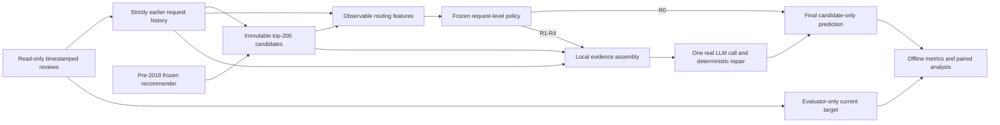

# Evidence allocation for next-item recommendation

**Working research report.** Conventional comparisons and the development pilot
and expanded LLM validation are complete. Content/strong-base controls, routing
selection and final-test results are still pending. This document must not be cited as a completed final study.
Current execution status is in [PROGRESS](../../docs/adaptive-evidence/PROGRESS.md).

## Research question and scope

We study whether inexpensive observable request features can determine when to
retain a conventional ranking, when to expose more user history to an LLM, and
when to add item categories. The target is a measured quality–cost tradeoff, not
a presupposed advantage from using an agent. A conventional or fixed method is
an acceptable final choice if the experiments support it.

The implemented agent is a request-level evidence-plan router. Evidence is
assembled from local, previously loaded history and metadata, followed by zero
or one LLM reranking call. It does not perform autonomous web search, multi-agent
reasoning, reinforcement learning, or successive decisions after tool results.
Local evidence-bundle counts are distinct from external network tool calls.
Sequential acquisition and stopping remain conditional research extensions.

## Data, visibility and evaluation unit

The main dataset is Amazon Reviews 2023, Magazine Subscriptions: 71,497 raw rows,
575 exact duplicates removed, and 70,922 valid timestamped events. Category
selection used only pre-2018 coverage and memory considerations; Digital Music
was rejected because its category coverage was 0.0127% and its item catalog was
much larger. Magazine's pre-2018 catalog contains 2,939 items, with category
metadata for 74.82%. Only 268 training users have five or more interactions.
See the [training-only data profile](../20260923_m1b_amazon_profile/README.md).

| Purpose | Global UTC interval |
|---|---|
| Base-model fitting | Before 2018-01-01 |
| Router labels and fitting | 2018-01-01 through 2019-12-31 |
| Validation and method selection | 2020-01-01 through 2020-12-31 |
| Final held-out evaluation | 2021-01-01 through 2023-09-09 |

Base hyperparameters use a further internal 2016 boundary, entirely within the
base period. Model weights and catalogs remain frozen after base training;
each request's history advances with the event stream. All events at a timestamp
are revealed only after predictions for that timestamp. Seen-item exclusion
uses all earlier ratings; ItemKNN preference uses ratings at least four.

An eligible target is a positively rated item not previously seen by that user.
One request per user is selected by a seeded hash before history stratification;
users are then sampled by hash where a cap is required. The main protocol is
`amazon_next_positive_unseen_v1`. It is a single-target full-catalog retrieval
followed by fixed-candidate reranking protocol, not sampled-negative reranking.
NDCG@10, hit rate@10 and candidate recall@200 include every sampled request.
Targets outside the catalog, retrieval misses and API failures are retained.
The target is never inserted into the candidate pool.

The earlier MovieLens foundation uses `ml100k_fixed_history_multipositive_v0`,
a time-window, multi-positive protocol. Its NDCG and recall numbers are not
directly comparable to the Amazon next-item results. It was reproduced twice
and its original commits were preserved when integrating the existing PR.

Strict time visibility applies to interaction history and user review text.
Item titles and categories come from a crawler snapshot assumed static; their
availability at the historical prediction time cannot be fully established.
Snapshot rating counts, prices and average ratings are excluded. Possible LLM
pretraining exposure to public reviews is not ruled out by prompt isolation.

## Conventional models and evidence actions

Popularity uses frozen positive-interaction counts. ItemKNN uses binary-positive
cosine similarity, source-row neighbors, additive denominator shrinkage, and
popularity/item-ID tie breaking. Inner validation selects 20 neighbors and
shrinkage 100 from nine combinations. The causal sequence baseline uses a
SASRec-style Transformer with full-softmax cross-entropy; it is an adaptation,
not a reproduction of the paper's sampled objective. Its six-checkpoint grid
selects 64 dimensions, one layer and 20 epochs. Models run on local CPU.

The primary evidence comparison fixes ItemKNN's top 200 candidates. The stronger
sequence comparison uses its own immutable candidate pool; differences between
retrievers must not be described as evidence-routing improvements.

| Action | Context supplied to reranker | Generation calls |
|---|---|---:|
| R0 | Retain base ranking | 0 |
| R1 | Candidate titles and latest user event | 1 |
| R2 | Candidate titles and up to 20 past events | 1 |
| R3 | R1 plus item categories | 1 |
| R4 | R2 plus item categories | 1 |

Each historical event includes its title, rating, age and truncated review text.
R2 uses the latest available 20 events in chronological order; it does not
implement semantic retrieval over an external long-term memory. Given the sparse
observed histories, this first experiment tests additional available history
without introducing an embedding or summary model. Findings must be stated at
that scope, especially for the group with only two or more events.
All text limits use tokenizer counts: title 40, category 48, review 128 tokens.
GPT-4.1 mini is pinned to `gpt-4.1-mini-2025-04-14`, temperature zero, maximum
256 output tokens, strict JSON output and top-10 candidate aliases. The prompt
marks supplied text as untrusted and preserves the base prior when evidence
does not justify a change. Deterministic repair retains valid unique candidates
and fills missing positions from the base ranking. No repair LLM is called.

R1–R4 are fixed local evidence workflows followed by one call. On requests with
little history, some actions have exactly identical inputs. Expanded matrices
share a generation only within that same request, candidate snapshot and exact
payload; they do not reuse a later or earlier user's output. Per-action costs
describe executing that action once. Offline construction counts each physical
generation once, rather than charging shared labels repeatedly.

There is no path from the current target to the router, evidence assembler or
model call. Earlier feedback becomes visible only to later requests, as in a
causal event replay. The design's separate B3/P2 multi-step comparison is outside
the currently implemented request-level stage; deterministic evidence loading
is not counted as multiple rounds of model reasoning.

## Routing, content controls and selection

The predeclared training sample contains all 917 nonempty-history policy users
and 128 sampled empty-history users, with one request selected before grouping.
Inverse inclusion weights correct the fitting objective. This enriched label
sample must not be reported as an unweighted population performance estimate.
Validation includes all 3,318 eligible users: 2,968 empty, 247 one-event and 103
older-history states. No history-rich subgroup is silently substituted for the
full request population.

Observable routing inputs are history count, positivity, catalog coverage, mean
rating, recency/span, and base-score concentration/gap. User ID, target, current
review, target rank and LLM outputs are absent. The small predeclared grid fits
Ridge or histogram boosting to action-minus-base NDCG, then subtracts a cost
penalty. Simple history-based rules and a budget-calibrated random allocator
provide direct controls. Random allocation probabilities and seeds are frozen
on validation; realized test costs may differ and are reported rather than
forced to match using test outcomes.
Budget points constrain validation mean cost, not a hard per-request or test-stream
spending limit. Actual test spending is reported for every policy and budget point.

The category-content diagnostic compares R4 with shuffled candidate/category
alignment, leaving candidate identities, order, titles, history and the category
text multiset unchanged. Provider input-token counts match exactly for all 478
diagnostic requests. The sample contains all 350 nonempty-history validation
states plus 128 empty-history states. Interpret state-specific results; its
unweighted aggregate is not the population effect. This control addresses
candidate-category alignment, not every possible mechanism of longer history.

The primary scientific comparison is learned versus rule routing at the frozen
USD 0.25 per 1,000 request budget point, with NDCG@10 as the primary metric.
Secondary budgets, fixed-plan and random comparisons are exploratory. The
whole-system deployment selection additionally includes all three conventional
models. Among eligible validation candidates within 0.002 NDCG of the best,
prefer lower API spending and then simpler methods. This selection tolerance
does not establish quality equivalence.

## Statistical and resource interpretation

Paired bootstrap resampling uses independent users, not repeated action outputs
as independent observations. Main final comparisons use 10,000 resamples and
95% intervals. History groups are fixed at zero, one and at least two events;
small groups are descriptive. A separate one-sided bound against the frozen
0.002 noninferiority margin is required for a noninferiority statement. A
two-sided interval crossing zero is not evidence of no quality loss. Intervals
after validation selection are descriptive and do not adjust for selection.

Token usage comes from provider responses, including cached input and all output
tokens. Exact provider input preflight includes the output schema. The durable
USD 50 ledger reserves before submission, retains unknown-call reservations,
and uses a USD 45 planning stop. No implicit retries, rented server or extra
credit purchase is authorized. Failed attempts, offline labels and controller
fitting are accounted separately from per-request counterfactual serving cost.
Public-price usage estimates are not reconciled invoices.

Batch pricing is an execution discount; it is not a routing benefit. Batch
turnaround cannot supply serving latency. A separate frozen synchronous audit
uses identical user sampling, CPU threads, concurrency one, timeout/retry rules
and disabled application output reuse. Automatic provider prefix-cache usage
is recorded. Its warm-model latency includes retrieval, feature/controller
work, prompt construction, token counting, rate queue, network and repair.

## Completed evidence and outstanding results

The [same-sample conventional comparison](../20260924_m3_validation_baselines/README.md)
finds validation NDCG@10 of 0.063170 (Popularity), 0.066556 (ItemKNN) and 0.068723
(sequence). Sequence minus ItemKNN is +0.002167, nominal paired interval
[+0.000173, +0.004190]; candidate coverage does not improve.

The [256-user development pilot](../20260924_m2_development_pilot/README.md)
does not establish aggregate LLM improvement. It also demonstrates that
identical temperature-zero inputs can produce different rankings: 118 of 489
same-request repeated-input groups changed ranking, seven changed NDCG. A
label-aware oracle therefore includes output noise and is not proof of a
learnable policy advantage.

The [complete 3,318-user evidence validation](../20260925_m3_evidence_validation/README.md)
finds R1 minus R0 NDCG +0.000612 [−0.002067, +0.003260], and R4 minus R0
−0.026559 [−0.032734, −0.020497]. R1 is slightly beneficial without observed
history but harmful in the at-least-two-event group. These exploratory findings
motivate adding two opposite-history rules in grid v2 before final testing, while
retaining the original learner grid, budgets and scientific primary comparison.
The original v1 rule list is preserved as part of the development record.

The [478-user equal-token control](../20260925_m3_content_control/README.md)
holds actual input counts and category-text multisets fixed. Correct category
alignment is better than shuffled alignment with history, but worse without
history. Its unweighted diagnostic mean is not representative of the request
population. Full evidence still trails ItemKNN on this cohort. Correct alignment
versus corrupted alignment is a narrower contrast than useful information versus
neutral padding; it does not establish a general benefit of adding categories.

Routing results, final results, final quality–cost figures,
failure cases and reconciled campaign resources must be added only after their
actual runs complete. No final method, adaptive gain or sequential stopping
result is asserted by this working report.

Current execution is blocked by the provider account's billing hard limit, with USD 11.0849600 conservatively accounted against the USD 50 project authorization. The [resource checkpoint](../20260925_resource_checkpoint/README.md) gives exact tokens, costs, preserved partial labels and a safe resume command. The [interim career materials](../career_materials/README.md) include only supported development claims. Expanded router fitting and final testing remain incomplete.

The zero-call [validation failure audit](../20260925_validation_failures/README.md)
finds that full evidence loses 388 base hits and rescues 196, whereas recent
evidence loses 38 and rescues 49. Both spend about 44.6% of their single-action
API cost on targets outside the fixed candidate pool. These are post-evaluation
diagnostics; target visibility cannot be used to skip those requests in a policy.
Deterministic examples show both useful rescues and harmful reordering, including
empty-history requests. They do not identify the model's internal reasoning or
justify changing the registered grid before test.
