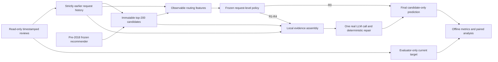
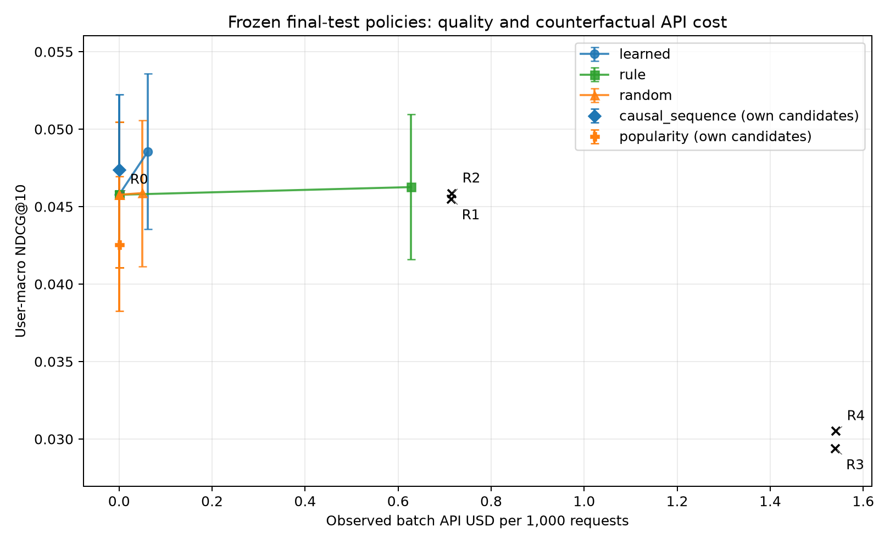

# Evidence allocation for next-item recommendation

**Research report, 2026-10-01 UTC.** The frozen 3,572-user final test, conventional
and evidence baselines, routing, component controls, strong-base robustness,
presentation sensitivity, paired statistics and failure audit are complete.
The validation-selected practical method remains the causal sequence recommender.
Primary routing policies all retain the base ranking; a secondary learned-policy
signal is exploratory. Synchronous serving measurement and final campaign
accounting are complete. The selected scope is request-level evidence selection;
unimplemented sequential capabilities are not included in the results.
Current execution status is in [PROGRESS](../../docs/adaptive-evidence/PROGRESS.md).
The [delivery evidence audit](DELIVERY_AUDIT.md) maps the requested end state to
completed evidence and remaining experiments.

## Research question and scope

We study whether inexpensive observable request features can determine when to
retain a conventional ranking, when to expose more user history to an LLM, and
when to add item categories. The target is a measured quality–cost tradeoff, not
a presupposed advantage from using an agent. A conventional or fixed method is
an acceptable final choice if the experiments support it.

The implemented agent is a request-level evidence-plan router. Evidence is
assembled from local, previously loaded history and metadata, followed by zero
or one LLM reranking call. It does not perform autonomous web search, multi-agent
reasoning, reinforcement learning, or successive decisions after tool results.
Local evidence-bundle counts are distinct from external network tool calls.
Sequential acquisition and stopping remain conditional research extensions.

## Data, visibility and evaluation unit

The main dataset is Amazon Reviews 2023, Magazine Subscriptions: 71,497 raw rows,
575 exact duplicates removed, and 70,922 valid timestamped events. Category
selection used only pre-2018 coverage and memory considerations; Digital Music
was rejected because its category coverage was 0.0127% and its item catalog was
much larger. Magazine's pre-2018 catalog contains 2,939 items, with category
metadata for 74.82%. Only 268 training users have five or more interactions.
See the [training-only data profile](../20260923_m1b_amazon_profile/README.md).

| Purpose | Global UTC interval |
|---|---|
| Base-model fitting | Before 2018-01-01 |
| Router labels and fitting | 2018-01-01 through 2019-12-31 |
| Validation and method selection | 2020-01-01 through 2020-12-31 |
| Final held-out evaluation | 2021-01-01 through 2023-09-09 |

Base hyperparameters use a further internal 2016 boundary, entirely within the
base period. Model weights and catalogs remain frozen after base training;
each request's history advances with the event stream. All events at a timestamp
are revealed only after predictions for that timestamp. Seen-item exclusion
uses all earlier ratings; ItemKNN preference uses ratings at least four.

An eligible target is a positively rated item not previously seen by that user.
One request per user is selected by a seeded hash before history stratification;
users are then sampled by hash where a cap is required. The main protocol is
`amazon_next_positive_unseen_v1`. It is a single-target full-catalog retrieval
followed by fixed-candidate reranking protocol, not sampled-negative reranking.
NDCG@10, hit rate@10 and candidate recall@200 include every sampled request.
Targets outside the catalog, retrieval misses and API failures are retained.
The target is never inserted into the candidate pool.

The earlier MovieLens foundation uses `ml100k_fixed_history_multipositive_v0`,
a time-window, multi-positive protocol. Its NDCG and recall numbers are not
directly comparable to the Amazon next-item results. It was reproduced twice
and its original commits were preserved when integrating the existing PR.

Strict time visibility applies to interaction history and user review text.
Item titles and categories come from a crawler snapshot assumed static; their
availability at the historical prediction time cannot be fully established.
Snapshot rating counts, prices and average ratings are excluded. Possible LLM
pretraining exposure to public reviews is not ruled out by prompt isolation.

## Conventional models and evidence actions

Popularity uses frozen positive-interaction counts. ItemKNN uses binary-positive
cosine similarity, source-row neighbors, additive denominator shrinkage, and
popularity/item-ID tie breaking. Inner validation selects 20 neighbors and
shrinkage 100 from nine combinations. The causal sequence baseline uses a
SASRec-style Transformer with full-softmax cross-entropy; it is an adaptation,
not a reproduction of the paper's sampled objective. Its six-checkpoint grid
selects 64 dimensions, one layer and 20 epochs. Models run on local CPU.

The primary evidence comparison fixes ItemKNN's top 200 candidates. The stronger
sequence comparison uses its own immutable candidate pool; differences between
retrievers must not be described as evidence-routing improvements.

| Action | Context supplied to reranker | Generation calls |
|---|---|---:|
| R0 | Retain base ranking | 0 |
| R1 | Candidate titles and latest user event | 1 |
| R2 | Candidate titles and up to 20 past events | 1 |
| R3 | R1 plus item categories | 1 |
| R4 | R2 plus item categories | 1 |

Each historical event includes its title, rating, age and truncated review text.
R2 uses the latest available 20 events in chronological order; it does not
implement semantic retrieval over an external long-term memory. Given the sparse
observed histories, this first experiment tests additional available history
without introducing an embedding or summary model. Findings must be stated at
that scope, especially for the group with only two or more events.
All text limits use tokenizer counts: title 40, category 48, review 128 tokens.
GPT-4.1 mini is pinned to `gpt-4.1-mini-2025-04-14`, temperature zero, maximum
256 output tokens, strict JSON output and top-10 candidate aliases. The prompt
marks supplied text as untrusted and preserves the base prior when evidence
does not justify a change. Deterministic repair retains valid unique candidates
and fills missing positions from the base ranking. No repair LLM is called.

R1–R4 are fixed local evidence workflows followed by one call. On requests with
little history, some actions have exactly identical inputs. Expanded matrices
share a generation only within that same request, candidate snapshot and exact
payload; they do not reuse a later or earlier user's output. Per-action costs
describe executing that action once. Offline construction counts each physical
generation once, rather than charging shared labels repeatedly.

```mermaid
flowchart LR
    D[Read-only timestamped reviews] --> V[Strictly earlier request history]
    D --> Y[Evaluator-only current target]
    B[Pre-2018 frozen recommender] --> C[Immutable top-200 candidates]
    V --> C
    C --> X[Observable routing features]
    V --> X
    X --> A[Frozen request-level policy]
    A -->|R0| P[Final candidate-only prediction]
    A -->|R1-R4| E[Local evidence assembly]
    V --> E
    C --> E
    E --> L[One real LLM call and deterministic repair]
    L --> P
    P --> Q[Offline metrics and paired analysis]
    Y --> Q
```

There is no path from the current target to the router, evidence assembler or
model call. Earlier feedback becomes visible only to later requests, as in a
causal event replay. The design's separate B3/P2 multi-step comparison is outside
the currently implemented request-level stage; deterministic evidence loading
is not counted as multiple rounds of model reasoning.

## Routing, content controls and selection

The predeclared training sample contains all 917 nonempty-history policy users
and 128 sampled empty-history users, with one request selected before grouping.
Inverse inclusion weights correct the fitting objective. This enriched label
sample must not be reported as an unweighted population performance estimate.
Validation includes all 3,318 eligible users: 2,968 empty, 247 one-event and 103
older-history states. No history-rich subgroup is silently substituted for the
full request population.

Observable routing inputs are history count, positivity, catalog coverage, mean
rating, recency/span, and base-score concentration/gap. User ID, target, current
review, target rank and LLM outputs are absent. The small predeclared grid fits
Ridge or histogram boosting to action-minus-base NDCG, then subtracts a cost
penalty. Simple history-based rules and a budget-calibrated random allocator
provide direct controls. Random allocation probabilities and seeds are frozen
on validation; realized test costs may differ and are reported rather than
forced to match using test outcomes.
Budget points constrain validation mean cost, not a hard per-request or test-stream
spending limit. Actual test spending is reported for every policy and budget point.

The category-content diagnostic compares R4 with shuffled candidate/category
alignment, leaving candidate identities, order, titles, history and the category
text multiset unchanged. Provider input-token counts match exactly for all 478
diagnostic requests. The sample contains all 350 nonempty-history validation
states plus 128 empty-history states. Interpret state-specific results; its
unweighted aggregate is not the population effect. This control addresses
candidate-category alignment, not every possible mechanism of longer history.

The primary scientific comparison is learned versus rule routing at the frozen
USD 0.25 per 1,000 request budget point, with NDCG@10 as the primary metric.
Secondary budgets, fixed-plan and random comparisons are exploratory. The
whole-system deployment selection additionally includes all three conventional
models. Among eligible validation candidates within 0.002 NDCG of the best,
prefer lower API spending and then simpler methods. This selection tolerance
does not establish quality equivalence.

## Statistical and resource interpretation

Paired bootstrap resampling uses independent users, not repeated action outputs
as independent observations. Main final comparisons use 10,000 resamples and
95% intervals. History groups are fixed at zero, one and at least two events;
small groups are descriptive. A separate one-sided bound against the frozen
0.002 noninferiority margin is required for a noninferiority statement. A
two-sided interval crossing zero is not evidence of no quality loss. Intervals
after validation selection are descriptive and do not adjust for selection.

Token usage comes from provider responses, including cached input and all output
tokens. Exact provider input preflight includes the output schema. The durable
USD 50 ledger reserves before submission, retains unknown-call reservations,
and uses a USD 45 planning stop. No implicit retries, rented server or extra
credit purchase is authorized. Failed attempts, offline labels and controller
fitting are accounted separately from per-request counterfactual serving cost.
Public-price usage estimates are not reconciled invoices.

Batch pricing is an execution discount; it is not a routing benefit. Batch
turnaround cannot supply serving latency. A separate frozen synchronous audit
uses identical user sampling, CPU threads, concurrency one, timeout/retry rules
and disabled application output reuse. Automatic provider prefix-cache usage
is recorded. Its warm-model latency includes retrieval, feature/controller
work, prompt construction, token counting, rate queue, network and repair.

## Development evidence

The [same-sample conventional comparison](../20260924_m3_validation_baselines/README.md)
finds validation NDCG@10 of 0.063170 (Popularity), 0.066556 (ItemKNN) and 0.068723
(sequence). Sequence minus ItemKNN is +0.002167, nominal paired interval
[+0.000173, +0.004190]; candidate coverage does not improve.

The [256-user development pilot](../20260924_m2_development_pilot/README.md)
does not establish aggregate LLM improvement. It also demonstrates that
identical temperature-zero inputs can produce different rankings: 118 of 489
same-request repeated-input groups changed ranking, seven changed NDCG. A
label-aware oracle therefore includes output noise and is not proof of a
learnable policy advantage.

The [complete 3,318-user evidence validation](../20260925_m3_evidence_validation/README.md)
finds R1 minus R0 NDCG +0.000612 [−0.002067, +0.003260], and R4 minus R0
−0.026559 [−0.032734, −0.020497]. R1 is slightly beneficial without observed
history but harmful in the at-least-two-event group. These exploratory findings
motivate adding two opposite-history rules in grid v2 before final testing, while
retaining the original learner grid, budgets and scientific primary comparison.
The original v1 rule list is preserved as part of the development record.

The [478-user equal-token control](../20260925_m3_content_control/README.md)
holds actual input counts and category-text multisets fixed. Correct category
alignment is better than shuffled alignment with history, but worse without
history. Its unweighted diagnostic mean is not representative of the request
population. Full evidence still trails ItemKNN on this cohort. Correct alignment
versus corrupted alignment is a narrower contrast than useful information versus
neutral padding; it does not establish a general benefit of adding categories.

The [frozen final report](../20261001_final_test/README.md) now supplies actual
test results, quality–cost figures and failure cases. No primary adaptive gain
or sequential stopping result is asserted. [Final serving and campaign resources](../20261001_final_resources/README.md)
are reported separately from the observed Batch outcome costs.

The earlier provider billing interruption was resolved on September 30. Policy-label collection resumed with USD 11.0849600 previously accounted against the original USD 50 authorization. The [historical resource checkpoint](../20260925_resource_checkpoint/README.md) preserves exact tokens, costs, partial labels and recovery evidence; it is not the final campaign bill. The shared ledger retains the old unknown pilot reservation. [Career materials](../career_materials/README.md) distinguish primary results, exploratory findings and unimplemented extensions.

The zero-call [validation failure audit](../20260925_validation_failures/README.md)
finds that full evidence loses 388 base hits and rescues 196, whereas recent
evidence loses 38 and rescues 49. Both spend about 44.6% of their single-action
API cost on targets outside the fixed candidate pool. These are post-evaluation
diagnostics; target visibility cannot be used to skip those requests in a policy.
Deterministic examples show both useful rescues and harmful reordering, including
empty-history requests. They do not identify the model's internal reasoning or
justify changing the registered grid before test.

## Complete routing development and adoption selection

The [full routing validation](../20260930_m4_routing_validation/README.md) fitted four utility estimators on 1,045 users with complete real action labels and inverse-inclusion weights. Labels cost USD 2.9788184; this includes the previously partial calls once. Offline refitting reproduces all four estimator file hashes and all 25 selected/fixed/random policies' actions on the 3,318-user validation set.

At the registered primary budget USD 0.25/1,000, all selected policies retain ItemKNN for every validation request. At the secondary envelope 1.5, learned routing calls the LLM for 174 requests and has NDCG 0.068006 at USD 0.044181/1,000, versus rule NDCG 0.068681 at USD 0.636895/1,000. The learner's one-sided lower quality bound -0.002205 fails the -0.002 margin; lower cost does not establish preserved quality. Superiority over the frozen-seed budget-matched random control is also unresolved. All these intervals are descriptive after validation selection.

Budget-envelope selection applies a 0.002 tolerance relative to the best feasible candidate, then minimizes cost. This explains both the all-base primary result and why secondary selected policies can spend much less than their allowed envelope. These are conclusions about this registered finite deterministic policy class and tolerance, not all possible adaptive or stochastic allocators. Most requests have no history and identical conventional inputs, further restricting deterministic differentiation. No parameters were changed to force a nonzero primary result.

The registered practical all-method comparison selects **the causal sequence recommender**, using NDCG 0.068723 and zero API expense on validation. This choice is separate from the within-ItemKNN primary scientific comparison and was preserved after test scoring. A stronger base-model comparison is not evidence-routing improvement. The final sequence NDCG is 0.047393; its difference from KNN, +0.001626 [−0.000143, +0.003411], is unresolved. The validation choice is not presented as a proven test winner.

## Completed strong-base evidence diagnostic

The [3,318-user sequence evidence study](../20260930_strong_base_evidence/README.md)
retains all 1,493 retrieval misses and 418 cold targets. Recent evidence minus its
own base is -0.002855 NDCG, nominal paired interval [-0.006230, +0.000434]; full
evidence minus base is -0.028562 [-0.034887, -0.022317]. Extra history alone has
an unresolved overall effect, while category-augmented actions remain harmful.
The complete 6,842 physical generations cost USD 7.7100102. Public outcome
reanalysis reproduces all statistics exactly without raw data or API access.

The paired difference between each retriever's R1 effect is -0.003467
[-0.006739, -0.000119] for sequence minus ItemKNN. This exploratory sensitivity
includes changed candidate composition/order and different model-output
realizations; it is not an isolated embedding effect or a routing improvement.
Empty-history R1 has a small positive difference, which cannot come from personal
history. The negative full-evidence result persists after strengthening the base.
These controls do not change the already frozen final choices.

## Sequential scope decision before final scoring

The implemented research scope remains request-level evidence selection and
one-call reranking. We do not add a sequential, post-tool controller to this
campaign. On complete development data, full evidence harms both base
recommenders; recent evidence has no established overall advantage; and the
learned allocator has not established quality preservation against the simple
rule or superiority over the frozen random control. The equal-token control
shows that category alignment matters in some groups, but does not demonstrate
that observing an intermediate tool result creates an additional useful
decision. Identical-input output variability also prevents treating the
label-aware action oracle as proof of learnable sequential gain.

This is a conditional scope decision under the original research route, not an
experimental finding that multistep acquisition is ineffective. No post-tool
policy, adaptive stopping rule, reflection, model-generated summary or
multistep-versus-full-evidence comparison was executed. That question remains
unmeasured. A later extension would need a concrete, prediction-time observable
intermediate result and a separate comparison against the same one-call
evidence and cost controls. This decision was recorded before the presentation
diagnostic, final scoring and synchronous resource audit. Those subsequent
requirements have now completed; the scope was not expanded or reselected from
the secondary test signal.

## Completed presentation diagnostic

The [same-user row-presentation control](../20261001_presentation_control/README.md) verifies all 6,636 logical input pairs against actual submitted payloads. Candidate identities/order, evidence and model options are fixed; displayed row order and its annotation change. Shuffled minus ordered R1 is -0.010127 NDCG [-0.013134, -0.007267]; R4 is -0.021811 [-0.026460, -0.017283]. The shuffled actions score 0.057041 and 0.018186, respectively, below the unchanged ItemKNN base 0.066556. Nominal exploratory intervals do not identify a unique causal mechanism.

Both changes are negative in the no-history majority; the small at-least-two-event group has wide presentation-effect intervals crossing zero. Alias IDs still retain the base-rank prior, and every shuffled input has eight extra tokens from the observed presentation change. This is not exact-token matching or complete removal of the prior; generation dates/output noise remain possible confounders. The separate equal-token alignment control addresses a different question.

This diagnostic costs USD 7.4874418 for 6,636 physical generations; its complete public archive reproduces all statistics exactly without API access. Four unused numeric-score roundoff differences in historical snapshot hashes are disclosed and independently checked against exact candidate identities and transmitted evidence. Both complete diagnostics satisfied the frozen final dispatch gate before any final generation, with all validation-selected choices unchanged.

## Frozen final test and method choice

The [complete final report](../20261001_final_test/README.md) contains the full
tables, groups, failure examples, public archive and run/commit map. All 3,572
users remain in the denominators; 1,949 targets are outside KNN's top 200,
including 685 cold items. The population has 3,148 users without history,
266 with one event and 158 with at least two. These constraints strongly limit
what reranking can achieve.

| Method | Test NDCG@10 | HR@10 | Observed Batch USD/1,000 |
|---|---:|---:|---:|
| Popularity (own candidates) | 0.042543 | 0.100784 | 0 |
| Causal sequence (own candidates; validation-selected) | 0.047393 | 0.105823 | 0 |
| ItemKNN / primary learned, rule, random and fixed | 0.045767 | 0.103024 | 0 |
| R1 recent evidence | 0.045513 | 0.100784 | 0.713239 |
| R2 longer history | 0.045849 | 0.101624 | 0.714397 |
| R3 recent + categories | 0.029380 | 0.069429 | 1.539596 |
| R4 full configured evidence / fixed workflow | 0.030512 | 0.071109 | 1.541184 |
| Secondary learned 1.5 | 0.048531 | 0.104143 | 0.061353 |
| Secondary random 1.5 | 0.045879 | 0.103024 | 0.050385 |
| Secondary rule 1.5 | 0.046261 | 0.104703 | 0.627485 |

The scientific primary policies are identical all-R0 actions. A zero-width
difference interval here is degenerate; it does not establish learned allocation
or general quality preservation. R1−R0 is −0.000254 [−0.003215, +0.002915]; the
one-sided lower bound also fails the prespecified 0.002 margin. R4−R0 is
−0.015255 [−0.020532, −0.009929]. Extra configured evidence is costly and harmful
in this setting; the negative result survives stronger-base validation controls.

The frozen secondary learner calls the LLM on 243/3,572 requests (6.80%).
Learned−rule NDCG is +0.002270 [+0.000166, +0.004563], with 90.22% less Batch
spend, but HR differs by −0.000560 [−0.003919, +0.003080]. Learned−random NDCG
is +0.002651 [+0.000508, +0.004993], but the learner spends **21.77% more** than
that frozen random sample. These are nominal exploratory budget-grid results,
not the primary finding or a cross-metric production guarantee.

An explicitly post-evaluation sensitivity fixes that cost mismatch in
expectation. The original cost-only calibration formula preserves the learner's
conditional non-R0 mixture and rescales its call probability; it receives no
labels, quality or features. Expected random and learned actual cost both equal
USD 0.0613531355/1,000. Learned−expected random NDCG is +0.002997
[+0.001036, +0.005105], while HR +0.001693 [−0.001321, +0.004721] is unresolved.
Its intervals condition on this observed cost calibration and saved model draws;
they do not validate a deployable test-calibrated rule. No new API calls or
reselection occurred. This supports further independent investigation of
selective evidence, without replacing the frozen primary comparison.

## What the experiments actually establish

| Question | Evidence-supported answer |
|---|---|
| Which evidence helps which requests? | Small recent-evidence gains recur in the no-history majority, so they are not personal-history gains. The ≥2-history R1 final effect is −0.043716 [−0.080291, −0.008058]; one-history effects remain uncertain. Category-augmented actions harm the population. |
| Content or merely more tokens? | The exactly token-matched alignment diagnostic shows content correspondence matters within its stratified cohort. It compares correct with corrupted alignment, not neutral padding. It does not justify a general category benefit. |
| Better allocation than rules/random? | No primary-policy advantage. A frozen secondary NDCG signal survives an exploratory equal-expected-cost diagnosis, with uncertain HR and no test-based reselection. |
| Are multiple steps better than one full call? | Unmeasured. Development evidence did not establish a useful post-tool decision, so the conditional extension was not implemented. This is not proof that multistep methods fail. |
| What adds expense without helping? | Full configured evidence roughly doubles per-request input cost versus recent evidence and substantially lowers quality. Many calls address targets outside the candidate pool; this can only be recognized retrospectively. |
| Does the conclusion survive a stronger base? | Full evidence also harms causal-sequence candidates on validation. Cross-retriever effects include changed candidate sets/order and model-output draws. |
| Typical failures? | Retrieval misses/cold items, sparse histories, lost base hits after semantic reordering, output repairs and sensitivity to row presentation. Hash-selected examples illustrate behavior, not hidden model reasoning. |

The final practical choice remains the **causal sequence baseline**, selected on
validation for quality and zero generation expense. “Zero API” does not mean
zero local compute. A later study could preregister the secondary signal on a
new population/model draw. Reusing this test to tune, force nonzero primary
actions or select the best observed policy would invalidate its role.

## Actual service cost, compute and financial completion

The [final resource report](../20261001_final_resources/README.md) contains full
phase charges, exact tokens, operations, repairs, CPU coverage and service
records. The campaign costs **USD 37.3714568 in known usage**, plus an old
**USD 0.0035016** unknown pilot reserve: **USD 37.3749584 accounted**, with no
pending reservations or running experiment roots and USD 12.6250416 remaining
from the USD 50 authorization. This is usage-based pricing, not an invoice.

There are 32,817 observed-usage generations, one unknown-usage generation and
108 confirmed pre-generation rejections. Known totals are 182,255,677 input
tokens (including 5,310,720 cached) and 1,181,412 output tokens. Accounting
retains 208 repaired/fallback physical outputs, 14,257 token-count operations,
82,462 local evidence accesses and separate management/recovery operations.
Offline policy labels cost USD 2.9788184; four fitting blocks took 7.9375 CPU
seconds, apart from other development work. Planning/reflection/summary/API
embedding calls were not executed. Local sequence embeddings still consume
training compute.

The registered resource-only audit executed 1,408 requests across 128 validation
users and eleven methods: 382 independent generations, zero failures/repairs,
USD 0.4284908 expense. Conditions were concurrency one, two CPU threads, fixed
pacing/timeout/retries and no application response reuse; provider caching was
measured. Selected causal-sequence service averaged **5.023 ms**, P95 **8.369 ms**.
Recent/full evidence averaged **3,112/3,229 ms**, P95 **4,315/4,403 ms**, at
observed standard-price costs **USD 0.736125/1.897309 per 1,000**. These include
durable research-budget bookkeeping and pacing, not only provider generation;
the implementation is not a production performance benchmark.

Secondary learned service averaged **100.765 ms**, overall P95 **21.618 ms**.
Only four requests generated: that branch averaged **2,759 ms**, P95 **3,732 ms**.
Its rare-branch quantile is descriptive, not a tail guarantee. Random generated
seven times with different realized caching/cost; this service audit is not
another matched-cost quality comparison. Its small validation sample must not
be combined with final-test Batch quality into a synthetic frontier.

At the audit cutoff, 116 timed root runs total **6,836.09375 CPU seconds**;
1,079 nested runs are excluded from double counting. Four early records lack
CPU timing and are disclosed, not imputed as zero. Coding-agent/tool work,
installation, later verification, energy, network bytes and provider-internal
compute are outside coverage. Summed run-wall time is not elapsed campaign time.
No cloud capacity was rented.

Both public serving and accounting archives reproduce without data downloads
or API access on Python 3.11 and 3.12. Service summaries are exact; maximum
financial difference is zero on 3.11 and 2.13e-14 USD on 3.12, below the unchanged
1e-12 roundoff tolerance. The [reproduction guide](../../docs/adaptive-evidence/REPRODUCE.md)
provides commands. [English LaTeX and bilingual interview materials](../career_materials/README.md)
use measured final results. Native LaTeX compilation remains unavailable because
the app compiler cannot initialize its platform directories; the source is
delivered without a PDF or layout-verification claim.
